# 数据库-MySQL

>内容参考总结⾃⽹络资料，如⼩林coding、MySQL45讲

## 基础知识讲解

### MySQL基础

#### 主键、索引、外键

##### 什么是主键

主键是⼀列，其值可以唯⼀标识表中的每⼀行数据，每个表只能有⼀个主键，⽽且主键的值不能重复，也不能包含NULL值，通常用来保证数据的唯⼀性和用于在表中查找特定的行。

##### 主键、外键、索引的区别

**定义：**
主键：唯⼀标识⼀条记录，不允许重复，不允许为空
外键：外键是⼀个表中的字段，其值是另⼀个表的主键，用于建⽴两个表之间的关系。
索引：没有重复值，但可以有⼀个空值 ，用于快速查询到数据。

**作用：**
主键：用于唯⼀标识表中每⼀行的字段
外键：主要用于和其它表建⽴联系
索引：为了提⾼查询排序的速度

**区别：**
外键是⼀个表中的字段，它与另⼀个表的主键形成关联，用于建⽴表之间的关系。
主键和外键通常都与索引有关，但索引不⼀定是主键或外键。

#### MySQL表连接

##### 连接

将各个表中的记录都取出来进行依次匹配，将匹配后的结果发给客户端

##### 笛卡尔积

连接查询的结果中包含⼀个表的每⼀条记录与另⼀个表中每⼀条记录的组合，这样的查询结果就是笛卡尔积
⽐如表a有5条记录；表b有6条记录；a和b的笛卡尔积就是30

##### 连接过程

1、确定第⼀个需要查询的表，此表为`驱动表`
2、从驱动表中取每⼀条符合搜索条件的记录，到接下来的表中查找匹配的记录；驱动表之后的那个表就叫`被驱动表`

只需要访问驱动表⼀次，可能会多次访问被驱动表
每获得⼀条满⾜条件的驱动表记录，⻢上到被驱动表中寻找匹配的记录

##### 内连接

驱动表中的记录在被驱动表中找不到匹配的记录，那么驱动表的这条记录不会加⼊到最后的结果中

```sql
select * from 驱动表, 被驱动表;
select * from 驱动表 join 被驱动表;
select * from 驱动表 inner join 被驱动表;
select * from 驱动表 cross join 被驱动表;
```

##### 外连接

驱动表中的记录在被驱动表中找不到匹配的记录，也仍需要加⼊到最后结果中
左外连接：语句左侧的表为驱动表

```sql
select * from 驱动表 left join 被驱动表 on 连接条件;
```

右外连接：语句右侧的表为驱动表

```sql
select * from 被驱动表 right join 驱动表 on 连接条件;
```

对于内连接，驱动表和被驱动表的顺序可以更换；对于外连接，这个顺序不能随意更换

#### 过滤条件

##### where=

不论内外连接，只要是不符合 where ⼦句的记录都不会加⼊到最后的结果中

##### on

在内连接中与 where 等价；
在外连接中，如果驱动表中的记录在被驱动表中没有记录可以匹配，该驱动表记录仍会加⼊到结果中，对应的被驱动表字段以 null 填充

##### 嵌套循环连接

如果有3个表进行连接，那么表1和表2完成连接后的结果作为驱动表，将表3作为被驱动表进行连接查询

#### 执行⼀次 select 语句，发⽣了什么

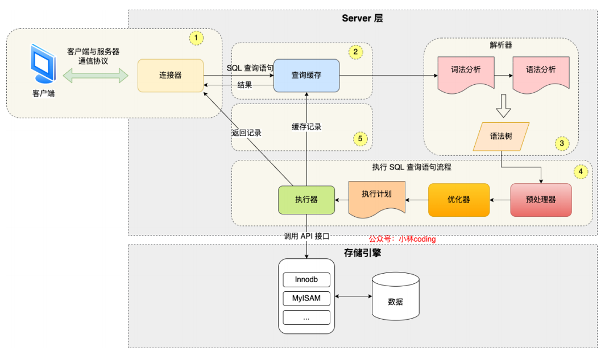

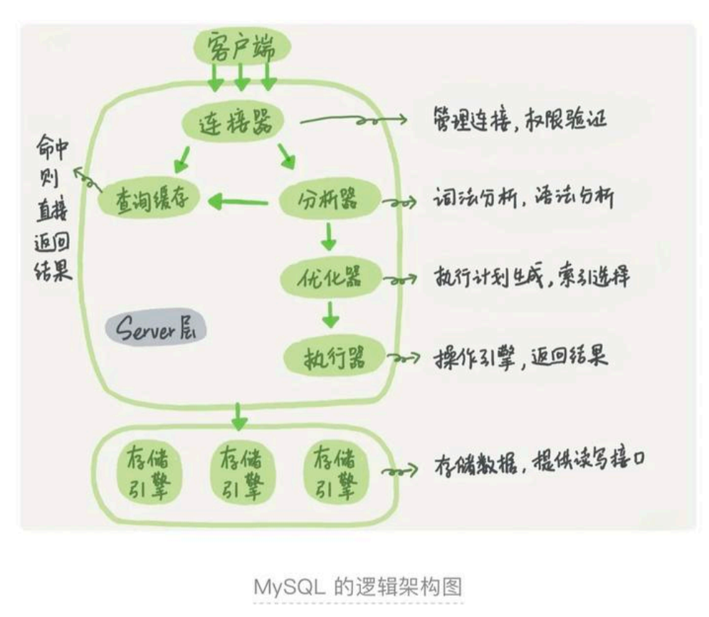

MySQL 的架构共分为两层：Server 层和存储引擎层

- Server 层负责建⽴连接、分析和执行 SQL
- 存储引擎层负责数据的存储和提取, ⽀持 InnoDB、MyISAM、Memory 等多个存储引擎, 现在最常用的存储引擎是 InnoDB，其⽀持索引类型是 B+ 树索引。

##### 连接器：管理连接和权限验证

连接器跟客户端建⽴连接、获取权限、然后后⾯的权限逻辑判断都基于此时读取到的权限。

Mysql 会定期⾃动清理"空闲"连接，由参数 wait_timeout 控制的，默认值是 8 ⼩时。
由于建⽴连接⽐较复杂，所以尽量使用⻓连接，⽽不是 短连接(少量查询后，就断开连接)
但是，当`⻓连接`过多时，可能导致内存占用太⼤，被系统强行杀掉（OOM），会导致`MySQL`异常重启。

解决⽅案为:

- 定期断开⻓连接
- MySQL 5.7以后版本，可以通过执行 mysql_reset_connection 来重新初始化连接资源

##### 查询缓存

执行查询语句前，先看下查询缓存中是否有结果

- 如果有，则不必执行查询语句，直接取出缓存结果
- 如果没命中缓存，则执行查询语句，并将执行查询语句后的结果，放⼊查询缓存中

不建议使用查询缓存(当数据表频繁更新时，最新查询结果可能和查询缓存中存放的结果不⼀致)

>MySQL 8.0 开始，执行⼀条 SQL 查询语句，不会再⾛到查询缓存这个阶段了。

##### 解析SQL

你输⼊的是由多个字符串和空格组成的⼀条SQL语句，MySQL需要识别出里⾯的字符串分别是什么，代表什么。

- 词法分析：根据你输⼊的字符串识别出关键字出来
- 语法分析：根据词法分析的结果判断是否符合SQL语法，并构建SQL语法课

##### 执行SQL

分为三个阶段：预处理阶段、优化阶段、执行阶段

预处理阶段：判断表和字段是否存在

优化阶段：**将SQL查询语句的执行⽅案确定下来**，⽐如在表里⾯有多个索引的时候，优化器会基于查询成本的考虑，来决定选择使用哪个索引, 或者在⼀个语句有多表关联（join）的时候，决定各个表的连接顺序。

执行阶段：MySQL通过分析器知道了你要做什么，通过优化器知道了该怎么做，于是就进⼊了执行器阶段，开始执行语句（执行语句时，⾸先会判断当前用户是否有执行权限）。

#### 执行⼀次update语句，发⽣了什么

查询语句的流程，更新语句同样需要⾛⼀遍

1. 执行语句前先连接数据库
2. 数据库表有更新，跟表有关的查询缓存会失效，所以会清空之前的缓存结果
3. 分析器进行词法和语法解析，优化器进行优化，执行器负责执行，然后更新。

但是更新流程涉及到了两个重要的⽇志模块：`redo log(重做⽇志)`和`binlog(归档⽇志)`, 具体会在⽇志章节中讲解。

`redo log` 和 `binlog` 有什么不同？

- `redo log` 是 `InnoDB` 引擎特有的； `binlog`是`MySQL`的`Server`层实现的，所有引擎都可以使用。
`redo log`是物理⽇志，记录的是“在某个数据⻚上做了什么修改”；`binlog`是逻辑日志，记录的是这个语句的原始逻辑，⽐如“给`ID=2`这⼀行的`c`字段加`1`
`redo log`是循环写的，空间固定会用完；`binlog`是可以追加写⼊的。“追加写”是指`binlog`⽂件写到⼀定⼤⼩后会切换到下⼀个，并不会覆盖以前的⽇志。

### MySQL语句

⽬的：为了保证MySql服务器的安全，每个MySql的用户应该对他们需要的数据具有适当的访问权;
例如:

1. 多数用户只能够用到读写权限，只有少数用户能够创建表格和删除表格
2. ⼀些用户只能访问某个数据库⽽不能访问其他的数据库
3. ⼀些用户可以管理其他用户的账号，但⼤多数⼈不需要管理别⼈的账号

每个用户需要用到什么权限，就只给他们什么权限

如果每个用户的权限都很⾼，那数据库会变得⼗分危险，随时都需要⾯临很多误操作，所以要进行访问权限控制

#### 用户账号存储

在 MySql 下，所有的用户的账号，密码，对数据库的操作权限，都存储在 mysql 下（数据库的名字就叫 mysql）的 user 表格中。
user 表格有⼀个 user 属性，user 属性就是当前所有的用户名，通过以下操作可以查看当前 mysql 的用户⼀共有多少。

```sql
use mysql 
select user from user
```

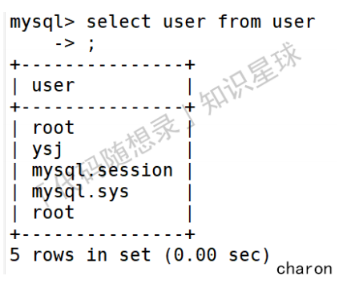

#### 用户账号管理

既然 mysql 中的 user 表格中存放着当前 mysql 的用户，那么新增用户只需要在 user 表中使用 insert 语句新增⼀条记录即可。
不过为了安全起⻅不建议这样做，mysql 数据库存放着很重要的数据，这样直接对 mysql 数据库直接操作可能会伤害到 mysql 服务器。

##### 新增用户

新增⼀个用户的语法：

```sql
CREATE USER [user_name] IDENTIFIED BY [user_pwd]
```

例如：新增用户 zhangsan，pwd=123456

```sql
CREATE USER zhangsan IDENTIFIED BY '123456'
```

##### 修改用户名

修改用户名的语法：

```sql
RENAME USER [user_name] TO [new_user_name]
```

例如：例如将账号名从 zhangsan 改为 lisi

```sql
RENAME USER zhangsan TO lisi
```

##### 修改用户密码

修改用户密码语法

```sql
SET PASSWORD FOR [user_name] = Password('[new_pwd]')
```

这里使用 password 函数对新密码进行加密。
如果不指定用户名：

```sql
SET PASSWORD = Password('[new_pwd]')
```

默认为修改当前登陆的用户的密码。
例如：修改 lisi 账号的密码：

```sql
SET PASSWORD FOR lisi = Password('135790')
```

##### 用户账号删除

删除用户账号语法：

```sql
DROP USER [user_name]
```

例如：删除 lisi 的账号

```sql
DROP USER lisi
```

如果mysql版本低于mysql5，需要先revoke用户所有的权限，才能删除账号。更⾼版本则可以⼀次性删除权限和账号。

##### 用户权限控制

###### 查看用户权限

刚创建的的用户是没有任何权限的，使用以下语法查看某用户所拥有的权限：

```sql
SHOW GRANTS FOR [user_name]
```

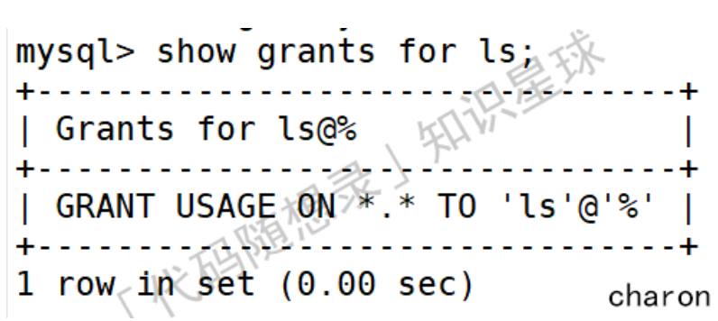

⽽`GRANT USAGE ON *.* TO 'lS'@'%'`则代表了用户`ls`没有任何权限。

###### 用户授权

给用户授权的语法：

```sql
GRANT [权限名] ON [数据库名].[表名] TO [用户名]
```

例如：用户 'ls' 查找权限 select

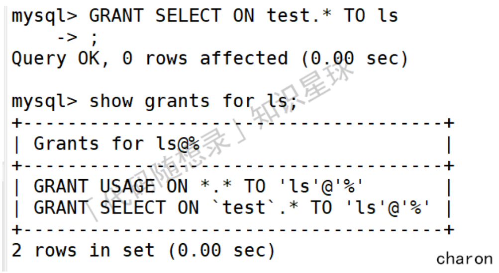

从表格中可以看到`ls`新增的权限。

###### 撤销授权

撤销用户权限的语法：

```sql
REVOKE [权限名] ON [数据库名].[表名] FROM [用户名]
```

收回用户`ls`查找权限`select`

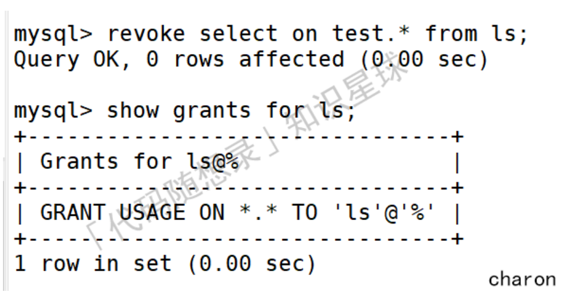

从表格中可以看初 ls 新增的权限消失了

### 索引

#### 什么是索引

索引：索引的出现其实就是为了提⾼数据查询的效率，就像书的⽬录⼀样
MySQL 在查询⽅⾯主要就是**两种⽅式**：

1. 全表扫描（⼀个⼀个挨个找）
2. 根据索引检索

#### 索引操作

##### 创建索引

```sql
create index 索引名 on 表名(列名);
# 也可以有多个列名构成索引（即，组合索引）
```

##### 删除索引

```sql
drop index 索引名 on 表名;
```

#### 怎么查看⼀个SQL语句是否使用了索引进行检索

在 SQL 语句前，添加 explian 关键字

- 当`type=ALL`时，表示使用 全表查询（未使用索引）
- 当`type=RES`时，表示使用索引

#### 索引有哪些类别

- 按「数据结构」分类：B+tree索引、Hash索引、Full-text索引。
- 按「物理存储」分类：聚簇索引（主键索引）、⼆级索引（辅助索引）。
- 按「字段特性」分类：主键索引、唯⼀索引、普通索引、前缀索引。
- 按「字段个数」分类：单列索引、联合索引。

##### 按照数据结构分类

- 哈希表：使用 `key-value` 对存储数据 ，可能存在 hash 冲突（多个 value 对应同⼀个 key）
  - 优点：key ⽆序，插⼊数据时⽆需维护顺序（直接在最后⼀个元素后追加，即可），效率较⾼；
  - 缺点：因为不是有序的，所以哈希索引做区间查询的速度是很慢 
  - 适用场景：适用于只有等值查询的场景，⽽不适用频繁 区间查找
- 有序数组：
  - 优点：等值查询 和 区间查询 性能都挺6 （有序数组 适合 查询） 
  - 缺点：有序数组不适合 频繁 增/删 记录的场景 （但是，有序数组不适合 增/删）
  - 等值查询使用⼆分（前提是，有序 + 顺序存储），查询时间复杂度 O(log N)
  - 区间查询先用 ⼆分查找 “左边界”（不存在的时，则找第⼀个⽐ 它⼤的记录） ，然后，再向右扫描，直⾄⼤于右边界
  - 适用场景：有序数组只适用于静态存储引擎，在 等值查询 和 范围（区间）查询 场景中的性能⾮常优秀
- ⼆叉搜索树
  - BST 是为了 保留了 “有序数组” 查询（⼆分，O(logN)）性能好的优点，同时解决“有序数组” 不适合 增/删的缺点
  - BST 查询的时间复杂度：O(log N) ，但是，为了维持 O(log(N)) 的查询复杂度，就需要保持这棵树是平衡⼆叉树。（维护 BST 是 AVL 的时间复杂度也是 O(log(N))）
  - ⼆叉树是搜索效率最⾼的，但是实际上⼤多数的数据库存储却并不使用⼆叉树。其原因是，索引不止存在内存中，还要写到磁盘上
- N叉树
  - 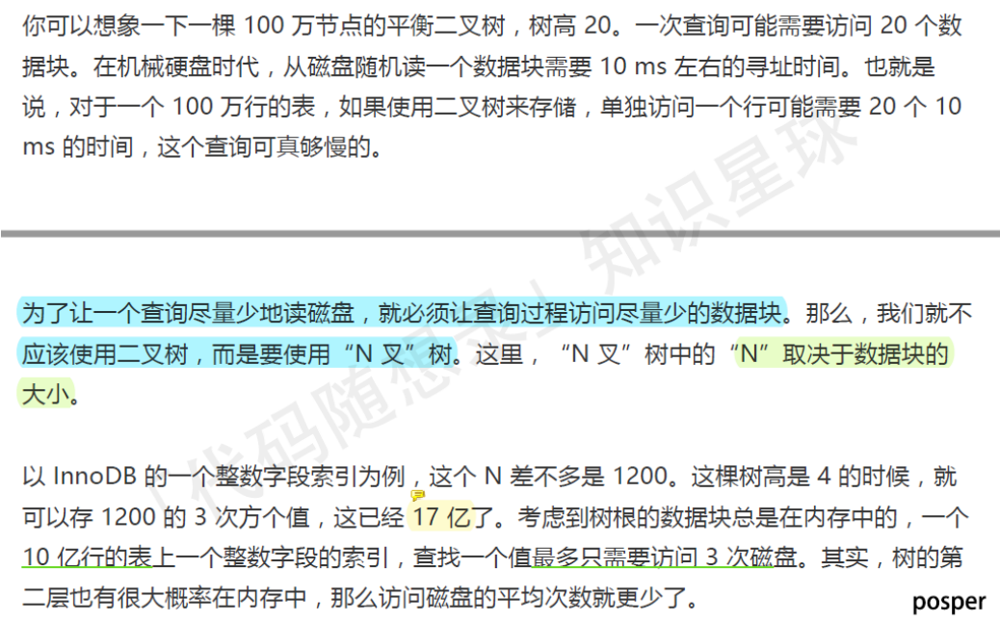
  - 为了让⼀个查询尽量少地读磁盘，就必须让查询过程访问尽量少的数据块。那么，我们就不应该使用⼆叉树，⽽是要使用 “N 叉”树（N 取决于数据块的⼤⼩）。即，通过使用 N 叉树 来降低 树的⾼度，即 减少读取磁盘的次数（IO是很慢的），提⾼查询效率 ⭐
  - N 叉树特点：
    - 折中 考虑了 “查询性能” 和 “读取磁盘的次数”，⼴泛应用于 数据库引擎中
    - MySQL 中，索引是在存储引擎层实现的，⽽且不同存储引擎的索引的⼯作⽅式并不⼀样。⽽即使多个存储引擎⽀持同⼀种类型的索引，其底层的实现也可能不同。

下⾯以InnoDB 为例，和你分析⼀下其中的索引模型

###### InnoDB 的索引模型

InnoDB 使用了 B+ 树索引模型，每⼀个索引在 InnoDB 里⾯对应⼀棵 B+ 树

假设建表语句如下，则对应的 2 棵 索引树（主键 ⾃动创建⼀颗；字段 k 创建 ⼀颗索引树），如下所示

```sql
create table T
(
    id int primary key, # 主键 ⾃动创建索引
    k int not null,
    name varchar(16),
    index (k)
) # 给字段 k 条件 索引
 
engine=InnoDB;
```


##### 按照存储分类

根据叶⼦节点的内容，索引类型分为主键索引（聚簇索引）和⼆级索引（辅助索引）：

- 主键索引的 B+Tree 的叶⼦节点存放的是实际数据，所有完整的用户记录都存放在主键索引的 B+Tree 的叶⼦节点里；
- ⼆级索引的 B+Tree 的叶⼦节点存放的是主键值，⽽不是实际数据。

###### 主键查询和⼆级索引查询

主键查询：直接在 主键索引 所在的 B+ 树中查询，然后直接返回查询到的叶⼦节点（此时，叶⼦节点里⾯就是整行记录）

⼆级索引查询：⾸先，在普通索引所在的 B+ 树中，查询到待查询记录的 主键； 然后，再根据这些查到的 主键，执行 “主键查询” （即，回表）

基于⾮主键索引的查询需要多扫描⼀棵索引树。因此，我们在应用中应该尽量使用主键查询。

不过当查询的数据是能在⼆级索引的 B+Tree 的叶⼦节点里查询到，这时就不用再查主键索引查，这种在⼆级索引的 B+Tree 就能查询到结果的过程就叫作「覆盖索引」

由于覆盖索引可以减少树的搜索次数，显著提升查询性能，所以使用覆盖索引是⼀个常用的性能优化手段。

##### 按照字段特性分类

- 主键索引：建⽴在主键字段上的索引，⼀张表最多只能有⼀个主键索引，不允许有空值。
- 唯⼀索引：建⽴在 UNIQUE 字段上的索引，⼀张表可以有多个唯⼀索引，索引列的值必须唯⼀，但是允许有空值。
- 普通索引：建⽴在普通字段上的索引
- 前缀索引：对字符类型字段的前⼏个字符建⽴的索引，⽽不是在整个字段上建⽴的索引，可以减⼩索引的⼤⼩，适用于较⻓列值的情况。

##### 按照字段个数分类

- 单列索引：建⽴在单列上的索引称为单列索引，⽐如主键索引；
- 联合索引：由多个列组合⽽成的索引。适用于多列的查询条件

#### 什么是最左匹配原则

通过将多个字段组合成⼀个索引，该索引就被称为联合索引。
使用联合索引时，存在**最左匹配原则**，也就是按照最左优先的⽅式进行索引的匹配。
最左匹配原则要求查询条件中的列应该从索引的最左边的列开始，并且不能跳过中间的列。如果查询条件不按照索引的顺序进行匹配，那么索引可能会失效。

举个例⼦：

- 如果查询条件为`WHERE column1 = 'value1'`，那么索引可以被有效使用。
- 如果查询条件为`WHERE column1 = 'value1' AND column2 = 'value2'`，同样索引可以被有效使用。
- 但如果查询条件为`WHERE column2 = 'value2'`或`WHERE column2 = 'value2' AND column3 = 'value3'`，则最左匹配原则不成⽴。

最左匹配时在遇到范围查询（如 >、<）的时候，就会停止匹配，范围查询的字段可以用到联合索引，但是范围查询字段的后⾯的字段⽆法用到联合索引。

#### 索引下推

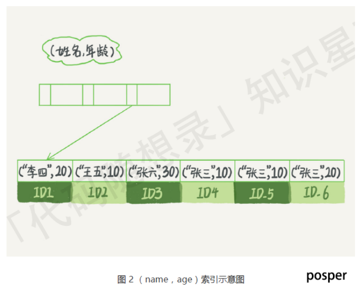

那些不符合最左前缀的部分，会怎么样呢？
⽐如，执行如下语句时候，则存在不符合最左前缀的部分：

```sql
select * from tuser
where name like '张 %'
and age=10
and ismale=1;
```

根据前缀索引规则，这个语句在搜索索引树的时候，只能用 “张”，找到第⼀个满⾜条件的记录 ID3
然后在 MySQL 5.6 之前，只能从 ID3 开始⼀个个回表，到主键索引上找出数据行，再对⽐字段值。
⽽ MySQL 5.6 引⼊了索引下推优化(index condition pushdown)
**可以在联合索引遍历过程中，对联合索引中包含的字段先做判断，直接过滤掉不满⾜条件的记录，减少回表次数。**

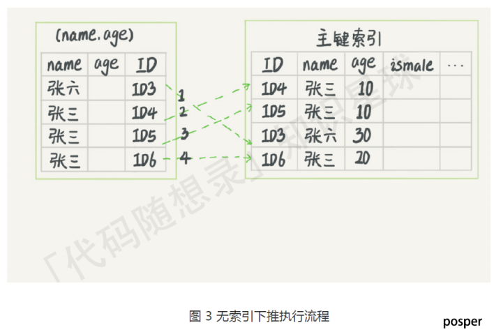
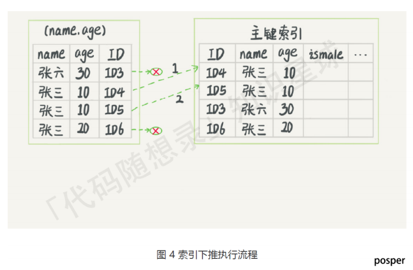

由图3可知，本例中`⽆索引优化`时，需要回表`4`次；
图4中，采用索引下推优化，直接在索引遍历的过程中，过滤了不符合条件的记录（ID3、ID6），只用回表`2`次

#### 索引区分度

索引区分度表示某个字段不同值的个数占整个表的⽐例，建⽴联合索引时，要把区分度⼤的字段排在前⾯。

#### 建⽴索引的注意事项

- 索引不是越多越好，虽然索引会提⾼ select 效率，但是也降低了insert以及update的效率
- 数据量⼩的表不需要建⽴索引，会增加额外的索引开销 
- 不经常使用的列不要建⽴索引 
- 频繁更新的列不要建⽴索引，会影响更新的效率

#### 索引的优缺点

优点：

- 使用索引可以⼤⼤加快数据的检索速度（⼤⼤减少检索的数据量），这也是创建索引的最主要的原因。
- 但是注意使用索引不⼀定能够提⾼查询性能，因为如果数据库的数据量不⼤，那么使用索引也不⼀定能够带来很⼤提升。其余⼤多数情况下，索引查询⽐全表扫描要快。
- 通过创建唯⼀性索引，可以保证数据库表中每⼀行数据的唯⼀性。

缺点：

- 空间消耗，⼀个索引对应的就是⼀棵 B+树，每⼀个节点都是⼀个 16KB ⼤⼩的⻚。占用的空间较⼤。
- 创建索引和维护索引需要耗费许多时间，当对表中的数据进行增删改的时候，如果数据有索引，那么索引也需要动态的修改，会降低 SQL 执行效率。

#### 什么时候需要创建索引

- 频繁用于查询的列需要创建索引
- ⼤表：对于很⼤的表，建⽴索引可以提⾼查询速度
- 唯⼀性要求：主键列和唯⼀性约束的列会⾃动创建唯⼀索引，但如果查询中经常包含唯⼀性条件，可以额外创建唯⼀性索引。
- 连接表的外键列：为外键列创建索引可以提⾼连接的效率。
- 频繁使用排序和分组的列：如果某列经常用于 ORDER BY 或 GROUP BY ⼦句可以创建索引

#### 什么时候不需要创建索引

- ⼩表：在⼩表上，索引不会带来显著的性能提升，还会增加维护开销。
- 经常进行更新的字段不需要创建索引
- 很少用于查询的字段
- 字段中存在⼤量重复数据，不需要创建索引，⽐如性别字段

#### 索引优化的⽅法

- 前缀索引优化：使用某个字段中字符串的前⼏个字符建⽴索引，从⽽减⼩索引字段⼤⼩
- 覆盖索引优化：从⼆级索引中可以查询得到记录，避免回表
- 主键索引最好是⾃增的；这样每次插⼊⼀条新记录，都是追加操作，不需要重新移动数据，⽽使用⾮⾃增主键会导致插⼊主键的索引值是随机的，这可能会插⼊到现有数据⻚的某个位置，导致其他数据的移动，造成⻚分裂。
- 避免过多的索引

#### 索引什么时候会失效

使用左或者左右模糊匹配：⽐如 LIKE '%abc' 这样的查询会导致索引失效。
在索引列上使用函数或表达式： 索引列上参与计算，索引失效

```sql
SELECT * FROM table WHERE UPPER(column) = 'VALUE';
```

- 在 WHERE ⼦句中，如果在 OR 前的条件列是索引列，⽽在 OR 后的条件列不是索引列，那么索引会失效。
- 违背最左匹配原则，索引失效
- 数据分布不均匀： 如果数据分布不均匀，例如某个索引列的⼤多数值都相同，选择性降低，导致索引失效。
- 隐式类型转换： 如果查询中的条件涉及到隐式类型转换，例如将字符串与数字⽐较，索引可能⽆法被使用。

#### 为什么使用B+树索引

- B+树的⾮叶⼦节点不存放实际的记录数据，仅存放索引，所以**数据量相同的情况下，相⽐存储即存索引⼜存记录的 B 树，B+树的⾮叶⼦节点可以存放更多的索引，因此 B+ 树可以⽐ B 树更「矮胖」，查询底层节点的磁盘 I/O次数会更少。**
- B+ 树有⼤量的冗余节点（所有⾮叶⼦节点都是冗余索引），这些冗余索引让 B+ 树在插⼊、删除的效率都更⾼，⽐如删除根节点的时候，不会像 B 树那样会发⽣复杂的树的变化；
- B+ 树叶⼦节点之间用链表连接了起来，有利于范围查询，⽽ B 树要实现范围查询，因此只能通过树的遍历来完成范围查询，这会涉及多个节点的磁盘 I/O 操作，范围查询效率不如 B+ 树。

### 事务

思维导图：

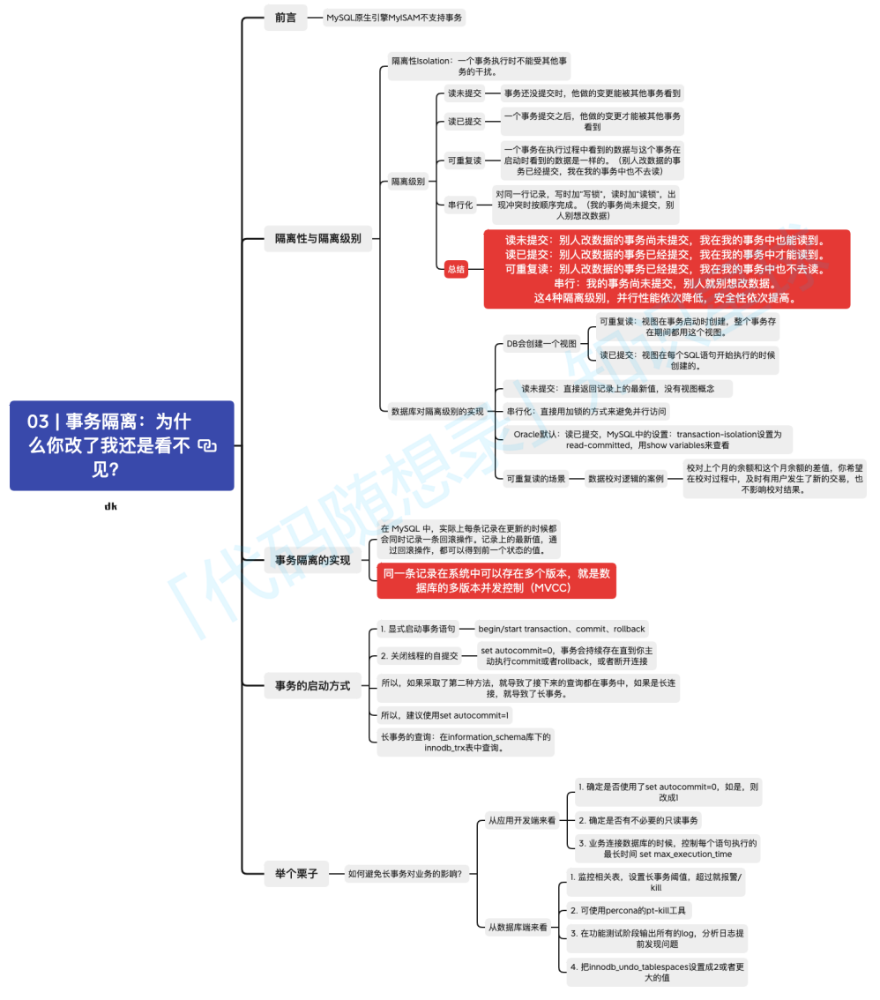

MySQL原⽣引擎MyISAM不⽀持事务，所以被InnoDB取代。

#### 事务的四⼤特性 ACID

ACID（Atomicity、Consistency、Isolation、Durability，即原⼦性、⼀致性、隔离性、持久性）

##### 原⼦性

事务是⼀个不可分割的⼯作单元，要么完全执行，要么完全不执行。如果在事务执行的过程中发⽣了错误，系统会撤销事务中已经执行的操作，将数据库恢复到事务开始前的状态。原⼦性是通过 undo log（回滚⽇志） 来保证的。

##### ⼀致性

确保事务将数据库从⼀个⼀致的状态转变为另⼀个⼀致的状态。事务执行的结果必须满⾜数据库的完整性约束和规则，保持数据库的⼀致性。⼀致性则是通过持久性+原⼦性+隔离性来保证的。

##### 隔离性

多个事务并发执行时，每个事务都不能看到其他事务的中间状态。每个事务都应该感觉就像它是唯⼀在数据库上运行的事务⼀样。防止了多个事务之间的相互⼲扰。隔离性是通过 MVCC（多版本并发控制） 或锁机制来保证的。

##### 持久性

⼀旦事务被提交，其结果将永久保存在数据库中，即使系统发⽣故障。即使系统发⽣崩溃，事务的结果也不应该丢失，持久性是通过`redo log(重做⽇志)`来保证的。

#### 并行事务会出现什么问题

并行事务是指多个事务同时执行，这可以提⾼数据库系统的性能和吞吐量。但是并行事务也可能引发⼀些问题

1. 脏读：读到其他事务未提交的数据
⼀个事务读取了另⼀个事务未提交的数据，如果另⼀个事务后来回滚，读取的数据就是⽆效的。读到了并⼀定最终存在的数据，这就是脏读。

2. 不可重复读：前后读取的数据不⼀致
在⼀个事务内，同⼀查询可能返回不同的结果，因为在事务执行期间其他事务可能修改了数据。

3. 幻读：前后读取的记录数量不⼀致
在⼀个事务内多次查询某个符合查询条件的「记录数量」，如果出现前后两次查询到的记录数量不⼀样的情况，就意味着发⽣了「幻读」现象。

这三个现象严重性排序如下：


#### 隔离级别

隔离级别是指多个并发事务之间相互隔离的程度，SQL标准定义了4个隔离级别


1. 读未提交：
最低的隔离级别。在这个级别下，⼀个事务可以读取到另⼀个事务未提交的数据。这可能导致脏读（DirtyReads）和不可重复读、幻读等问题。

2. 读提交：
在这个级别下，⼀个事务只能读取到已经提交的其他事务的数据。这解决了脏读的问题，但仍可能遇到不可重复读的问题。

3. 可重复读
在这个级别下，⼀个事务在其⽣命周期内多次执行相同的查询，将始终看到相同的数据，但是，仍可能发⽣幻读。也是MySQL InnoDB 引擎的默认隔离级别；

4. 可串行化
提供了最⾼的隔离级别。会对记录加上读写锁，在多个事务对这条记录进行读写操作时，如果发⽣了读写冲突的时候，后访问的事务必须等前⼀个事务执行完成，才能继续执行，在这个级别下，事务的执行效果就好像它们是按顺序执行的，事务之间没有并发。这可以防止脏读、不可重复读和幻读，但也可能导致性能下降，因为并发性降低。

选择隔离级别需要根据应用程序的要求和性能需求进行权衡。较低的隔离级别提供更⾼的并发性能，但可能牺牲⼀致性。较⾼的隔离级别提供更强的⼀致性，但可能降低并发性能。


- 在「读未提交」隔离级别下，可能发⽣脏读、不可重复读和幻读现象；
- 在「读提交」隔离级别下，可能发⽣不可重复读和幻读现象，但是不可能发⽣脏读现象；
- 在「可重复读」隔离级别下，可能发⽣幻读现象，但是不可能脏读和不可重复读现象；
- 在「串行化」隔离级别下，脏读、不可重复读和幻读现象都不可能会发⽣。

#### 幻读是如何解决的

MySQL InnoDB 引擎的默认隔离级别虽然是「可重复读」，但是它很⼤程度上可以避免幻读现象。解决的⽅案有两种：

- 针对快照读（普通 select 语句），是通过 MVCC ⽅式解决了幻读
- 针对当前读：（select ... for update 等语句），是通过 next-key lock（记录锁+间隙锁）⽅式解决了幻读，因为当执行 select ... for update 语句的时候，会加上 next-key lock，如果有其他事务在 next-key lock 锁范围内插⼊。

#### 事务隔离的实现

隔离级别具体是如何实现的呢？

- 对于读未提交，可以读到未提交事务修改的数据，所以直接读取最新的数据就可以。
- 对于串行化：加读写锁的⽅式来避免并行访问
- 对于读提交和可重复读，通过 Read View 来实现的
  - 「读提交」隔离级别是在每个 select 都会⽣成⼀个新的 Read View，也意味着，事务期间的多次读取同⼀条数据，前后两次读的数据可能会出现不⼀致，因为可能这期间另外⼀个事务修改了该记录，并提交了事务。
  - 「可重复读」隔离级别是启动事务时⽣成⼀个 Read View，然后整个事务期间都在用这个 Read View，这样就保证了在事务期间读到的数据都是事务启动前的记录。

#### Read View在MVCC中是如何⼯作的

1. 事务启动：当⼀个事务启动时，系统会为该事务创建⼀个 Read View。
2. Read View 包含的信息
    
   - m_ids : 当前数据库中「活跃事务」的事务 id 列表, 表示启动了但还没有提交的事务
   - min_trx_id : 「活跃事务」中事务id 最⼩的事务
   - max_trx_id : 当前数据库中应该给下⼀个事务的 id 值
   - creator_trx_id : 创建该Read View的事务的id

    除此之外，聚簇索引记录中都包含下⾯两个隐藏列：

    - trx_id ，当⼀个事务对某条聚簇索引记录进行改动时，就会把该事务的事务 id 记录在 trx_id 隐藏列里；
    - roll_pointer ，每次对某条聚簇索引记录进行改动时，都会把旧版本的记录写⼊到 undo ⽇志中，然后这个隐藏列是个指针，指向每⼀个旧版本记录，于是就可以通过它找到修改前的记录。

3. 事务读取数据：当⼀个事务要执行读操作时，系统会使用 Read View 来确定该事务能够看到哪些数据版本。具体步骤如下：
   - 如果记录的 trx_id ⼩于Read View 中的 min_trx_id 值，表示这个版本的记录是在创建 Read View 前已经提交的事务⽣成的，所以该版本的记录对当前事务可⻅。
   - 如果记录的 trx_id 值⼤于等于 Read View 中的 max_trx_id 值，表示这个版本的记录是在创建 Read View 后才启动的事务⽣成的，所以该版本的记录对当前事务不可⻅。
   - 如果记录的 trx_id 值在 Read View 的 min_trx_id 和 max_trx_id 之间，需要判断 trx_id 是否在m_ids 列表中：
     - 如果记录的 trx_id 在 m_ids 列表中，表示⽣成该版本记录的活跃事务依然活跃着（还没提交事务），所以该版本的记录对当前事务不可⻅。
     - 如果记录的 trx_id 不在 m_ids 列表中，表示⽣成该版本记录的活跃事务已经被提交，所以该版本的记录对当前事务可⻅。

4. 事务提交：当⼀个事务提交时，它的事务ID会加⼊到已提交的事务ID集合中。这样，其他事务的 Read View就能够看到该事务提交的数据版本。

#### 读已提交是怎么实现的

使用 MVCC(多版本并法控制) 实现的

- 读操作：在MVCC中，每个事务在读取数据时都可以看到数据的⼀个版本。已提交的事务产⽣⼀个版本，⽽未提交的事务则不会对其他事务可⻅。因此，读已提交只能看到已提交事务的版本。
- 写操作： 写操作创建⼀个新的数据版本，⽽不是直接修改原始数据。这确保了正在进行的事务不会看到未提交事务的更改。

#### 事务的启动⽅式

显式启动事务语句

```sql
begin/start transaction、commit、rollback
```

关闭线程的⾃提交

```sql
set autocommit=0;
```

事务会持续存在直到你主动执行commit或者rollback，或者断开连接，所以，如果采取了第⼆种⽅法，就导致了接下来的查询都在事务中，如果是⻓连接，就导致了⻓事务。

所以，建议使用 set autocommit=1

##### ⻓事务的查询

在informationschema库下的innodbtrx表中查询。

##### 举个栗⼦

如何避免⻓事务对业务的影响？

##### 从应用开发端来看

1. 确定是否使用了set autocommit=0，如是，则改成1
2. 确定是否有不必要的只读事务
3. 业务连接数据库的时候，控制每个语句执行的最⻓时间 set maxexecutiontime

##### 从数据库端来看

1. 监控相关表，设置⻓事务阈值，超过就报警/kill
2. 可使用percona的pt-kill⼯具
3. 在功能测试阶段输出所有的log，分析⽇志提前发现问题
4. 把innodbundotablespaces设置成2或者更⼤的值

### 锁

多个事物在【并发情况下】会出现⼀些经典的问题，如脏读、不可重复读、幻读、丢失更新。为了不同程度的解决这些问题，出现了不同的隔离级别，锁就是实现各种隔离级别的⼀种⽅式。

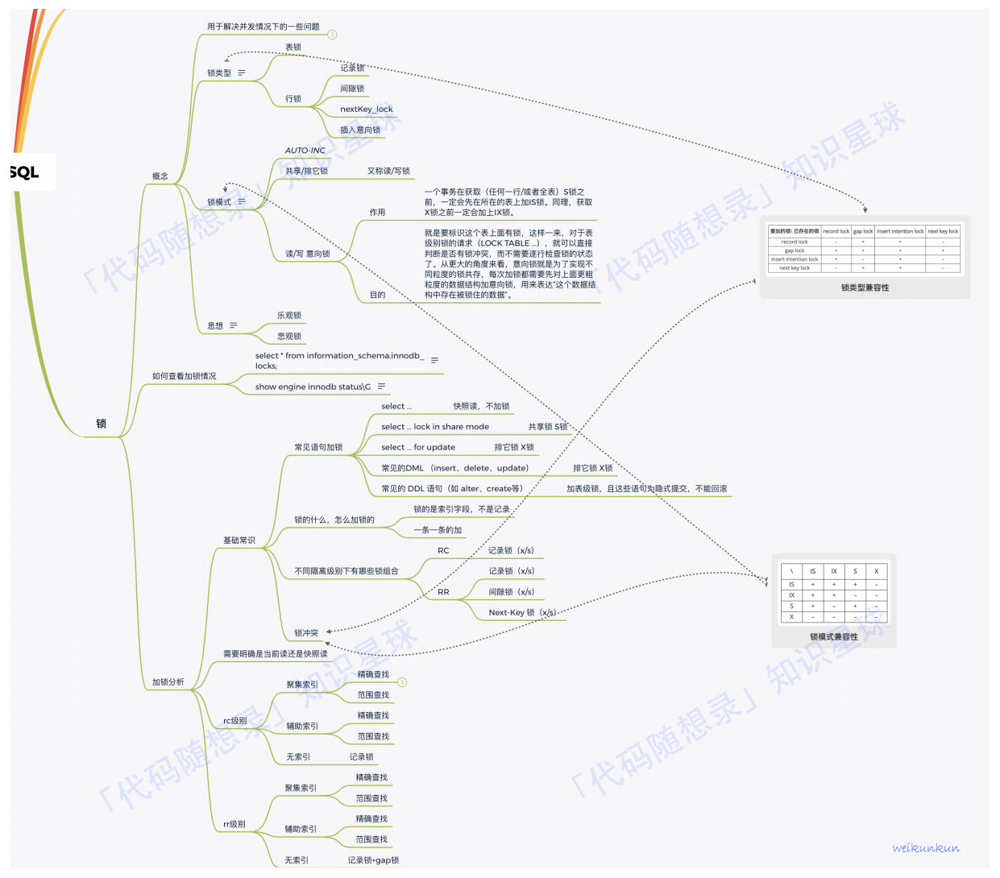

#### 锁的种类

##### 全局锁

顾名思义，全局锁就是**对整个数据库**实例加锁。
**典型使用场景**：全库逻辑备份，即把整个库的表都select出来存成⽂本
MySQL 提供了⼀个加全局读锁的⽅法，命令是

```sql
flush tables with read lock (FTWRL)
```

当你需要让整个库处于只读状态的时候，可以使用这个命令，之后其他线程的以下语句会被阻塞：

- 数据更新语句（数据的增删改）
- 数据定义语句（包括建表、修改表结构等）
- 更新类事务的提交语句

##### 表级锁

MySQL 里⾯表级别的锁有下⾯⼏种：

###### 表锁

特点：

- 每次操作锁住整张表
- 开销⼩，加锁快
- 并发度最低

表锁的语法是`lock tables … read/write`
与 FTWRL 类似，可以用`unlock tables`主动释放锁，也可以在客户端断开的时候⾃动释放。
**需要注意**：`lock tables`语法除了会限制别的线程的读写外，也限定了本线程接下来的操作对象

###### 元数据锁（meta data lock，MDL）

MDL 不需要显式使用，在访问⼀个表的时候会被⾃动加上。
MDL 的作用：保证读写的正确性。

你可以想象⼀下，如果⼀个查询正在遍历⼀个表中的数据，⽽执行期间另⼀个线程对这个表结构做变更，删了⼀列，那么查询线程拿到的结果跟表结构对不上，肯定是不行的。
在 MySQL 5.5 版本中引⼊了 MDL

当对⼀个表做增删改查操作的时候，加 MDL 读锁；
当要对表做结构变更操作的时候，加 MDL 写锁。

读锁之间不互斥，因此你可以有多个线程同时对⼀张表增删改查。读写锁之间、写锁之间是互斥的，用来保证变更表结构操作的安全性。因此，如果有两个线程要同时给⼀个表加字段，其中⼀个要等另⼀个执行完才能开始执行。

事务中的 MDL 锁，在语句执行开始时申请，但是语句结束后并不会⻢上释放，⽽会等到整个事务提交后再释放。（这可能会产⽣死锁的问题）

###### 意向锁

意向锁用于指示⼀个事务在未来可能会请求对某些资源（如数据行）的锁定

- 意向共享锁表示事务打算在资源上获得共享锁。其他事务可以继续获得共享锁，但不能获得排他锁。
- 意向排他（独占）锁： 表示事务打算在资源上获得排他锁。

对某些记录加上「共享锁」之前，需要先在表级别加上⼀个「意向共享锁」，对某些纪录加上「独占锁」之前，需要先在表级别加上⼀个「意向独占锁」。
意向共享锁和意向独占锁是表级锁，不会和行级的共享锁和独占锁发⽣冲突，意向锁之间也不会发⽣冲突，只会和共享表锁和独占表锁发⽣冲突。意向锁的⽬的是为了快速判断表里是否有记录被加锁。

###### AUTO-INC 锁

**作用**：表里的主键通常都会设置成⾃增的，之后可以在插⼊数据时，可以不指定主键的值，数据库会⾃动给主键赋值递增的值通过`AUTO-INC`锁实现的。**在插⼊数据时，会加⼀个表级别的 AUTO-INC 锁**，然后为被`AUTO_INCREMENT`修饰的字段赋值递增的值，等插⼊语句执行完成后，才会把 AUTO-INC 锁释放掉。其他事务的如果要向该表插⼊语句都会被阻塞，从⽽保证插⼊数据时字段的值是连续递增的。

**缺陷**：对⼤量数据进行插⼊的时候，会影响插⼊性能，因为其他事务中的插⼊会被阻塞。

**改进**：InnoDB 存储引擎提供了⼀种轻量级的锁来实现⾃增。在插⼊数据的时候，会为被 AUTO_INCREMENT 修饰的字段加上轻量级锁，然后给该字段赋值⼀个⾃增的值，就把这个轻量级锁释放了，⽽不需要等待整个插⼊语句执行完后才释放锁

##### 行级锁

顾名思义，行锁就是针对数据表中行记录的锁（也有⼈称为记录锁）。

这很好理解，⽐如事务 A 更新了⼀行，⽽这时候事务 B 也要更新同⼀行，则必须等事务 A 的操作完成后才能进行更新。

**类型**：

- Record Lock，记录锁，仅仅把⼀条记录锁上，记录锁分为排他锁和共享锁。
- Gap Lock，间隙锁，锁定⼀个范围，但是不包含记录本身，只存在于可重复读隔离级别，⽬的是为了解决可重复读隔离级别下幻读的现象。间隙锁之间是兼容的，两个事务可以同时持有包含共同间隙范围的间隙锁，并不存在互斥关系。
- Next-Key Lock：Record Lock + Gap Lock 的组合，锁定⼀个范围，并且锁定记录本身。next-key lock 即能保护该记录，⼜能阻止其他事务将新纪录插⼊到被保护记录前⾯的间隙中。

特点：

- 每次操作锁住⼀行数据
- 开销⼤，加锁慢
- 发⽣锁冲突的概率是最低的，并发度是最⾼的

在 InnoDB 事务中，行锁是在需要的时候才加上的，但并不是不需要了就⽴刻释放，⽽是要等到事务结束时才释放。这个就是两阶段锁协议。

知道了这个设定，对我们使用事务有什么帮助呢？那就是，如果你的事务中需要锁多个行，要把最可能造成锁冲突、最可能影响并发度的锁尽量往后放。

**加锁规则**
加锁规则里⾯，包含了两个“原则”、两个“优化”和⼀个“bug”

**两个原则**：

1. 加锁的基本单位是 next-key lock。希望你还记得，next-key lock 是前开后闭区间。
2. 查找过程中访问到的对象才会加锁。

**两个优化**：

1. 索引上的等值查询，给唯⼀索引加锁的时候，next-key lock 退化为行锁。 
2. 索引上的等值查询，向右遍历时且最后⼀个值不满⾜等值条件的时候，next-key lock 退化为间隙锁。

**⼀个"bug"**：

1. 唯⼀索引上的范围查询会访问到不满⾜条件的第⼀个值为止。（MySQL8.0之后的版本已经修复）

以上规则是在可重复读隔离级别 (repeatable-read) 下验证的。同时，可重复读隔离级别遵守两阶段锁协议，所有加锁的资源，都是在事务提交或者回滚的时候才释放的。如果切换到读提交隔离级别 (read-committed) 的话，就好理解了，过程中去掉间隙锁的部分，也就是只剩下行锁的部分。

#### 锁的划分

##### 数据库⻆度

###### 共享锁（共享锁也叫读锁或 S 锁）

共享锁锁定的资源可以被其他用户读取，但不能修改。
在进行SELECT的时候，会将对象进行共享锁锁定，当数据读取完毕之后，就会释放共享锁，这样就可以保证数据在读取时不被修改。
如果我们想要给某⼀行加上共享锁呢，⽐如想对 user_id=10的数据行加上共享锁，可以像下⾯这样:

```sql
SELECT user_id FROM product_comment WHERE user_id = 10 LOCK IN SHARE MODE;
```

###### 排他锁（排它锁也叫独占锁、写锁或 X 锁）

排它锁锁定的数据只允许进行锁定操作的事务使用，其他事务⽆法对已锁定的数据进行查询或修改。
如果我们想要在某个数据行上添加排它锁，⽐如针对 user_id=10的数据行，则写成如下这样：

```sql
SELECT user_id FROM product_comment WHERE user_id = 10 FOR UPDATE;
```

另外当我们对数据进行更新的时候，也就是INSERT、DELETE或者UPDATE的时候，数据库也会⾃动使用排它锁，防止其他事务对该数据行进行操作。

###### 共享锁与排他锁

共享锁和排他锁不仅可以锁住⼀行，也可以锁住⼀张表，如下所示：
⽐如我们想给 product_comment 在表上加共享锁，可以使用下⾯这行命令

```sql
LOCK TABLE product_comment READ;
```

如果我们想要对表上的共享锁进行解锁，可以使用下⾯这行命令：

```sql
UNLOCK TABLE;
```

如果我们想给 product_comment 数据表添加排它锁，可以使用下⾯这行命令

```sql
LOCK TABLE product_comment WRITE;
```

这时只有获得排它锁的事务可以对`product_comment`进行查询或修改，其他事务如果想要在`product_comment`表上查询数据，则需要等待。
你可以⾃己开两个 MySQL 客户端来模拟下。这时我们释放掉排它锁，使用这行命令即可

```sql
UNLOCK TABLE;
```

###### 意向锁（Intent Lock）

简单来说就是给更⼤⼀级别的空间示意里⾯是否已经上过锁。
**举例**：
你可以给整个房⼦设置⼀个标识，告诉它里⾯有⼈，即使你只是获取了房⼦中某⼀个房间的锁。这样其他⼈如果想要获取整个房⼦的控制权，只需要看这个房⼦的标识即可，不需要再对房⼦中的每个房间进行查找。这样是不是很⽅便？

返回数据表的场景，如果我们给某⼀行数据加上了排它锁，数据库会⾃动给更⼤⼀级的空间，⽐如数据⻚或数据表加上意向锁，告诉其他⼈这个数据⻚或数据表已经有⼈上过排它锁了，这样当其他⼈想要获取数据表排它锁的时候，只需要了解是否有⼈已经获取了这个数据表的意向排他锁即可。

如果事务想要获得数据表中某些记录的共享锁，就需要在数据表上添加意向共享锁。同理，事务想要获得数据表中某些记录的排他锁，就需要在数据表上添加意向排他锁。这时，意向锁会告诉其他事务已经有⼈锁定了表中的某些记录，不能对整个表进行全表扫描。

##### 程序员⻆度

###### 乐观锁（Optimistic Locking）

认为对同⼀数据的并发操作不会总发⽣，属于⼩概率事件，不用每次都对数据上锁，也就是不采用数据库⾃身的锁机制，⽽是通过程序来实现。在程序上，我们可以采用版本号机制或者时间戳机制实现。

###### 悲观锁（Pessimistic Locking）

也是⼀种思想，对数据被其他事务的修改持保守态度，会通过数据库⾃身的锁机制来实现，从⽽保证数据操作的排它性。

###### 乐观锁和悲观锁的适用场景

（1）乐观锁
适合读操作多的场景，相对来说写的操作⽐较少。它的优点在于程序实现，不存在死锁问题，不过适用场景也会相
对乐观，因为它阻止不了除了程序以外的数据库操作。

（2）悲观锁
适合写操作多的场景，因为写的操作具有排它性。采用悲观锁的⽅式，可以在数据库层⾯阻止其他事务对该数据的
操作权限，防止读 - 写和写 - 写的冲突。但是加锁的时间会⽐较⻓，可能会⻓时间限制其他用户的访问，也就是说
他的并发访问性不好。

#### Innodb使用表锁还是行锁

对于Innodb，绝⼤部分情况应该使用行锁
使用表锁的情况
（1）表⽐较⼤，事务需要更新全部或者⼤部分数据
（2）事务涉及到多个表，⽐较复杂，可能引起死锁，造成⼤量的事务回滚

### ⽇志

在前⾯中，我们提到了【更新语句】会设计到⽇志，具体包含下⾯⼏种

- **undo log（回滚⽇志）**：是 Innodb 存储引擎层⽣成的⽇志，实现了事务中的**原⼦性**，主要用于事务回滚和MVCC。
- **redo log（重做⽇志）**：是 Innodb 存储引擎层⽣成的⽇志，实现了事务中的**持久性**，主要用于掉电等故障恢复；
- **binlog （归档⽇志）**：是 Server 层⽣成的⽇志，主要**用于数据备份和主从复制**；

#### 什么是undo logo

当事务对数据库进行更新（插⼊、修改、删除）时，系统会记录相应的 `undo log` ，以便在事务回滚或系统崩溃时进行数据恢复, 主要用于事务回滚和`MVCC`。 `undo log` 记录的信息包括操作类型（插⼊、删除还是更新），修改前的数据值，被修改的数据的位置，事务标识id等，⽐如在更新⼀条记录时，要把被更新的列的旧值记下来，这样之后回滚时再把这些列更新为旧值就好了。
每⼀次更新操作产⽣的`undo log`格式都有⼀个`roll_pointer`指针(将undo log 串成⼀个链表, 链表也被成为版本链)和⼀个 trx_id 事务id(记录是被哪个事务修改的)

- 事务回滚：如果事务在执行过程中出现错误或被用户显式地回滚，系统可以使用 `undo log` 来还原事务所做的所有修改。通过 `undo log` ，数据库系统可以逆向执行事务的操作，将数据库还原到事务开始前的状态。
- 实现 MVCC（多版本并发控制）关键因素之⼀。MVCC 是通过 ReadView + undo log 实现的。undo log 为每条记录保存多份历史数据，MySQL 在执行快照读（普通 select 语句）的时候，会根据事务的 Read View 里的信息，顺着 undo log 的版本链找到满⾜其可⻅性的记录。

#### 什么是redo log

redo log 是物理⽇志，记录了某个数据⻚做了什么修改，⽐如**对XXX 表空间中的 YYY 数据⻚ ZZZ 偏移量的地⽅做了AAA 更新**，每当执行⼀个事务就会产⽣这样的⼀条或者多条物理⽇志。在事务提交时，只要先将 redo log 持久化到磁盘即可

#### redo log和undo log的区别是什么

undo log 和 redo log 这两个⽇志都是 Innodb 存储引擎⽣成的。

- redo log 记录了此次事务「完成后」的数据状态，记录的是更新之后的值；
- undo log 记录了此次事务「开始前」的数据状态，记录的是更新之前的值；

事务提交之前发⽣了崩溃，重启后会通过 undo log 回滚事务，事务提交之后发⽣了崩溃，重启后会通过 redo log恢复事务

#### 什么是binlog

MySQL 在完成⼀条更新操作后，Server 层还会⽣成⼀条 binlog，等之后事务提交的时候，会将该事物执行过程中产⽣的所有 binlog 统⼀写 ⼊ binlog ⽂件。

binlog ⽂件是记录了所有数据库表结构变更和表数据修改的⽇志，不会记录查询类的操作，⽐如 SELECT 和 SHOW操作

#### redo log和bin log有什么区别

- 适用对象不同：binlog 是 MySQL 的 Server 层实现的，所有存储引擎都可以使用；redo log 是 Innodb 存储引擎实现的⽇志。
- ⽂件格式不同：redo log 是物理⽇志，记录的是在某个数据⻚做了什么修改，⽐如对 XXX 表空间中的 YYY 数据⻚ ZZZ 偏移量的地⽅做了AAA 更新。⽽ binlog 主要包括三种格式： Statement 、 Row 和 Mixed 。
- 写⼊⽅式不同：binlog 是追加写，写满⼀个⽂件，就创建⼀个新的⽂件继续写，不会覆盖以前的⽇志，保存的是全量的⽇志。redo log是循环写，⽇志空间⼤⼩是固定，全部写满就从头开始，保存未被刷⼊磁盘的脏⻚⽇志。
- 用途不同：binlog 用于备份恢复、主从复制；redo log 用于掉电等故障恢复。

所以会造成主从环境的数据不⼀致性。因为 redo log 影响主库的数据，binlog 影响从库的数据，redo log 和binlog 必须保持⼀致。
**两阶段提交把单个事务的提交拆分成了 2 个阶段，分别是准备(Prepare)阶段和提交(Commit)阶段**，每个阶段都由协调者(Coordinator)和参与者(Participant)共同完成。

#### 两阶段提交的过程

在 MySQL 的 InnoDB 存储引擎中，开启 binlog 的情况下，MySQL 会同时维护 binlog ⽇志与 InnoDB 的 redolog，为了保证这两个⽇志的⼀致性，MySQL 使用了**内部 XA 事务**，内部 XA 事务由 binlog 作为协调者，存储引擎是参与者。
当客户端执行 commit 语句或者在⾃动提交的情况下，MySQL 内部开启⼀个 XA 事务，**分两阶段来完成 XA 事务的提交**。
事务的提交过程有两个阶段，**将 redo log 的写⼊拆成了两个步骤：prepare 和 commit，中间再穿插写⼊binlog：**

- **prepare 阶段**：将 内部 XA 事务的 ID写⼊到 redo log，同时将 redo log 对应的事务状态设置为 prepare，然后将 redo log 持久化到磁盘。
- **commit 阶段**：把 内部 XA 事务的 ID写⼊到 binlog，然后将 binlog 持久化到磁盘，接着调用引擎的提交事务接⼝，将 redo log 状态设置为 commit，此时该状态并不需要持久化到磁盘，只需要 write 到⽂件系统的page cache 成功，只要 binlog 写磁盘成功，redo log 的状态还是 prepare 也没有关系，⼀样会被认为事务已经执行成功。

### 执行引擎

#### 有哪些执行引擎

在MySQL中，可以通过 SHOW ENGINES; 命令查看当前数据库⽀持的存储引擎。InnoDB是较为通用和常用的存储引擎。

- InnoDB : MySQL默认的事务性存储引擎，⽀持事务的提交（commit）和回滚（rollback），提供了行级锁定，⽀持外键约束和MVCC
- MyISAM : MyISAM 使用表级锁定, 不⽀持事务，⽀持全⽂索引，适用于以读操作为主的应用
- Memory : 将数据放在内存中，数据处理速度很快，但是当数据库重启或崩溃时，存储在内存中的数据将丢失。

#### 数据库引擎InnoDB与MyISAM的区别和适用场景？

1. 事务⽀持
   - InnoDB: ⽀持事务，具有ACID（原⼦性、⼀致性、隔离性、持久性）特性，适合需要数据⼀致性和完整性的应用，如银行系统或在线购物平台。
   - MyISAM: 不⽀持事务，不具备ACID特性，适用于读密集、写少的场景，如博客系统或新闻⽹站。
2. 锁
   - InnoDB: 行级锁，多个事务可以同时访问同⼀表的不同行。
   - MyISAM: 表级锁，对整个表进行锁定，导致并发性能下降，特别是在有⼤量写操作时。
3. 外键约束:
   - InnoDB: ⽀持外键约束，确保数据的⼀致性和完整性。
   - MyISAM: 不⽀持外键约束
4. 崩溃恢复(Crash Recovery):
   - InnoDB: ⽀持崩溃恢复
   - MyISAM: 在崩溃后恢复可能会导致数据损失。
5. 全⽂索引(Full-text Indexing):
   - InnoDB: ⽀持全⽂索引。
   - MyISAM: 也⽀持全⽂索引，并且在这⽅⾯表现的更加好。

总结：
InnoDB: 适用于需要事务⽀持、并发性能好、具有⾼写⼊需求的应用
MyISAM: 适用于读操作频繁、写⼊操作较少的应用

## MySQL常⻅问题

### 幻读连问

#### 什么是幻读？

幻读是指在同⼀个事务中，存在前后两次查询同⼀个范围的数据，但是第⼆次查询却看到了第⼀次查询没看到的行。
注意，幻读出现的场景：

1. 事务的隔离级别为可重复读，且是当前读
2. 幻读仅专指新插⼊的行

#### 幻读带来的问题？

1. 对⾏锁语义的破坏
2. 破坏了数据⼀致性

##### 怎么避免幻读？

存储引擎采用加间隙锁的⽅式来避免出现幻读

#### 为啥会出现幻读？

⾏锁只能锁定存在的⾏，针对新插⼊的操作没有限定

#### 间隙锁是啥？它怎么避免出现幻读的？它引⼊了什么新的问题？

**间隙锁：**

- 是专⻔用于解决幻读这种问题的锁，它锁的了⾏与⾏之间的间隙，**能够阻塞新插⼊的操作**
- 间隙锁的引⼊也带来了⼀些新的问题，⽐如：降低并发度，可能导致死锁。
- 注意，读读不互斥，读写/写读/写写是互斥的，但是间隙锁之间是不冲突的，间隙锁会阻塞插⼊操作。
- 另外，间隙锁在可重复读级别下才是有效的

**间隙锁和 next-key lock**：

- ⾏锁和间隙锁合称 next-key lock，这个锁是左开右闭的区间。
- MySQL 为了解决幻读问题，在线程更新数据并 next-key lock 的过程中，⾸先必须在可重复读的隔离级别下，执⾏以下的原则和优化：

**原则：**

- 原则 1：加锁的基本单位是 next-key lock，next-key lock 是前开后闭区间。
- 原则 2：查找过程中访问到的对象才会加锁。

**优化**：

- 优化 1：索引上的等值查询，给唯⼀索引加锁的时候，next-key lock 退化为⾏锁，如果不存在这个索引，退化为间隙锁。
- 优化 2：索引上的等值查询，向右遍历时且最后⼀个值不满⾜等值条件的时候，next-key lock 退化为间隙锁。

**注意**：

1. ⾮唯⼀索引的范围查询：范围查询都会访问到不满⾜条件的第⼀个值，并且不会执⾏上述的两个优化。唯⼀索引的范围查询仍旧会执⾏上述的优化。
2. delete 语句的和查询的加锁⽅式相同
3. limit 语句，遍历到满⾜条件的 n 条数据后，之后不再加 next-key lock

**死锁：不同线程可以给同⼀个间隙加锁。**
意思时只有我这个线程可以操控这个间隙，其他线程不能使用，加锁时不会检测是否冲突的，但是如果两个都给同⼀个间隙上锁，之后两个线程都没办法在这个间隙上更新数据了，都会陷⼊等待另⼀个线程的间隙锁释放，也就是死锁。
如果使用读提交隔离级别，那么只加⾏锁，不加间隙锁，语句执⾏过程中加上的⾏锁，在语句执⾏完成后，就要把“不满⾜条件的⾏”上的⾏锁直接释放了，不需要等到事务提交才释放。

### 事务问题

#### for update的使用场景

⼀般这些操作都是很⻓⼀串并且是开启事务的。
如果库存刚开始读的时候是1，⽽⽴⻢另⼀个进程进⾏了update将库存更新为0了，⽽事务还没有结束，会将错的数据⼀直执⾏下去，就会有问题。
需要 for upate 进⾏数据加锁防止⾼并发时候数据出错，即 使事务保持 当前读 状态。

```sql
SELECT * FROM table LIMIT [offset,] rows | rows OFFSET offset; 
# 如果只给定⼀个参数，表示记录数。
```

```sql
mysql> SELECT * FROM orange LIMIT 5; # 检索前5条记录(1-5)
```

相当于

```sql
mysql> SELECT * from orange LIMIT 0,5;
```

两个参数，第⼀个参数表示offset, 第⼆个参数为记录数。

```sql
mysql> SELECT * FROM orange LIMIT 10,15; // 检索记录11-25
```

如果你想要清除⼀些MySQL使用内部缓存，你应该使用FLUSH命令

#### 事务隔离

innodb ⽀持 RC 和 RR 隔离级别实现是用的⼀致性视图(consistent read view)

事务在启动时会拍⼀个快照,这个快照是基于整个库的。

基于整个库的意思就是说⼀个事务内,整个库的修改对于该事务都是不可⻅的(对于快照读的情况)

如果在事务内 select t 表,另外的事务执⾏了DDL t表,根据发⽣时间,只有两种情况

1. 报错
2. 锁住

##### 事务是如何实现mvcc的？

（1）每个事务都有⼀个事务ID,叫做transaction id(严格递增)
（2）事务在启动时,找到已提交的最⼤事务ID记为up_limit_id。
（3）事务在更新⼀条语句时
⽐如 id=1 改为了 id=2.会把 id=1 和该⾏之前的 row trx_id 写到 undo log 里, 并且在数据⻚上把 id 的值改为 2,并且把修改这条语句的transaction id 记在该⾏⾏头
（4）再定⼀个规矩
⼀个事务要查看⼀条数据时,必须先用该事务的 up_limit_id 与该⾏的transaction id 做⽐对

- 如果 up_limit_id >= transaction id,那么可以看
- 如果 up_limit_id < transaction id,则只能去 undo log 里去取。

去 undo log 查找数据的时候,也需要做⽐对,必须 up_limit_id > transaction id，才返回数据

#### 什么是当前读

由于当前读都是先读后写,只能读当前的值,所以为当前读会更新事务内的 up_limit_id 为该事务的 transaction
你提到了隐藏列有⼀个DB_ROW_ID，是⼲嘛的？那假设有10个update，到第九个回滚了，DB_ROLL_PTR如何做的，那提交了是否更新DB_ROLL_PTR？

**为什么 rr 能实现可重复读⽽ rc 不能,分两种情况**
（1）快照读的情况下：
rr不能更新事务内的 up_limit_id ,⽽ rc 每次会把 up_limit_id 更新为快照读之前最新已提交事务的 transaction id,则 rc 不能可重复读
（2）当前读的情况下：
rr 是利用 record lock+gap lock来实现的,⽽ rc 没有 gap,所以 rc 不能可重复读

#### 选择普通索引还是唯⼀索引？

**1、对于查询过程来说**：
（1）普通索引
查到满⾜条件的第⼀个记录后，继续查找下⼀个记录，知道第⼀个不满⾜条件的记录
（2）唯⼀索引
由于索引唯⼀性，查到第⼀个满⾜条件的记录后，停止检索
但是，两者的性能差距微乎其微。因为InnoDB根据数据⻚来读写的。

**2、对于更新过程来说**：
**概念：change buffer**
当需要更新⼀个数据⻚：

- 如果数据⻚在内存中就直接更新
- 如果不在内存中，在不影响数据⼀致性的前提下，`InnoDB` 会将这些更新操作缓存在`change buffer` 中。

下次查询需要访问这个数据⻚的时候，将数据⻚读⼊内存，然后执⾏ `change buffer` 中的与这个⻚有关的操作。
`change buffer` 是可以持久化的数据。在内存中有拷⻉，也会被写⼊到磁盘上
`purge`：将 `change buffer` 中的操作应用到原数据⻚上，得到最新结果的过程，成为`purge`
访问这个数据⻚会触发 `purge`，系统有后台线程定期 `purge`，在数据库正常关闭的过程中，也会执⾏ `purge`

**唯⼀索引的更新不能使用 change buffer**
change buffer 用的是 buffer pool 里的内存，change buffer 的⼤⼩，可以通过参数
innodb_change_buffer_max_size 来动态设置。这个参数设置为50的时候，表示 change buffer 的⼤⼩最多只能占用 buffer pool 的50%。
将数据从磁盘读⼊内存涉及随机IO的访问，是数据库里⾯成本最⾼的操作之⼀。
change buffer 因为减少了随机磁盘访问，所以对更新性能的提升很明显。

**change buffer使用场景：**
在⼀个数据⻚做purge之前，change buffer记录的变更越多，收益就越⼤。
对于写多读少的业务来说，⻚⾯在写完以后⻢上被访问到的概率⽐较⼩，此时change buffer的使用效果最好。这种业务模型常⻅的就是账单类、⽇志类的系统。
反过来，假设⼀个业务的更新模式是写⼊之后⻢上会做查询，那么即使满⾜了条件，将更新先记录在changebuffer,但之后由于⻢上要访问这个数据⻚，会⽴即触发purge过程。
这样随机访问IO的次数不会减少，反⽽增加了change buffer的维护代价。所以，对于这种业务模式来说，changebuffer反⽽起到了副作用。

**索引的选择和实践：**
尽可能使用普通索引。
redo log主要节省的是随机写磁盘的IO消耗(转成顺序写)，⽽change buffer主要节省的则是随机读磁盘的IO消耗。

#### char 和 varchar 的区别？

char 是固定⻓度类型，⽐如：定义 char(10)，当你输⼊”abc”三个字符的时候，它们占的空间还是 10 个字节，其他 7 个是空字节。varchar ⻓度可变

存储情况不同
以 compact ⾏格式为例：
⼀条完整的记录由两部分组成

1. 变⻓字段的真正数据内容
2. 该变⻓字段所占用的字节数

该变⻓字段所占用的字节数被放在变⻓字段列表中，并且按照列的顺序逆序存放。
⽽ char 类型的数据则只需要存储其真正的数据内容。
对于 类型为 char(M) 的列

**如果采用的是变⻓编码的字符集：**
那么该列的值占用的字节数也会被存储到变⻓字段列表中，采用 变⻓编码字符集的 CHAR(M) 类型的值要求⾄少占用 M 个字节，但是 varchar(M) 没有这个要求。

#### MySQL抖⼀下是什么意思？

因为运⾏的不正常了，或者不稳定了，要花费更多的资需源处理别的事情，会使SQL语句的执⾏效率明显变慢。
针对innoDB导致MySQL抖的原因，主要是InnoDB 会在后台刷脏⻚，⽽刷脏⻚的过程是要将内存⻚写⼊磁盘。所以，⽆论是你的查询语句在需要内存的时候可能要求淘汰⼀个脏⻚，还是由于刷脏⻚的逻辑会占用 IO 资源并可能影响到了你的更新语句，都可能是造成你从业务端感知MySQL“抖”了⼀下的原因。

#### MySQL抖⼀下有啥问题？

很明显系统不稳定，性能突然下降对业务端是很不友好的

#### 怎么让MySQL不抖？

设置合理参数配配置，尤其是设置 好innodb_io_capacity 的值，并且平时要多关注脏⻚⽐例，不要让它经常接近75%

### 脏⻚

#### 啥是脏⻚？

当内存数据⻚跟磁盘数据⻚内容不⼀致的时候，我们称这个内存⻚为“脏⻚”。

#### 啥是⼲净⻚？

内存数据写⼊到磁盘后，内存和磁盘上的数据⻚的内容就⼀致了，称为“⼲净⻚”。

#### 脏⻚是咋产⽣的？

因为使用了WAL技术，这个技术会把数据库的随机写转化为顺序写，但副作用就是会产⽣脏⻚。

#### 啥是随机写？为啥那么耗性能？

随机写我的理解是，这次写磁盘的那个扇区和上⼀次没啥关系，需要重新定位位置，机械运动是很慢的即使不是机械运动重新定位写磁盘的位置也是很耗时的。

#### 啥是顺序写？

顺序写我的理解是，这次写磁盘那个扇区就在上⼀次的下⼀个位置，不需要重新定位写磁盘的位置速度当然会快⼀些。

#### WAL怎么把随机写转化为顺序写的？

写redolog是顺序写的，先写redolog等合适的时候再写磁盘，间接的将随机写变成了顺序写，性能确实会提⾼不少。

#### 为啥删除了表的⼀半数8据，表⽂⽂件⼤⼩没变化？

因为delete 命令其实只是把记录的位置，或者数据⻚标记为了“可复用”，但磁盘⽂件的⼤⼩是不会变的。也可以认为是⼀种逻辑删除，所以物理空间没有实际释放，只是标记为可复用，表⽂件的⼤⼩当然是不变的啦！

### 表结构

#### 表的数据信息存在哪里？

表数据信息可能较⼩也可能巨⼤⽆⽐，可以存储在共享表空间里，也可以单独存储在⼀个以.ibd为后缀的⽂件里，由参数 innodb_file_per_table 来控制，建议总是作为⼀个单独的⽂件来存储，这样⾮常容易管理，并且在不需要的时候，使用 drop table 命令也能直接把对应的⽂件删除，如果存储在共享空间之中即使表删除了空间也不会释放

#### 表的结构信息存在哪里？

⾸先，表结构定义占有的存储空间⽐较⼩ 
MySQL8.0 之前：表结构的定义信息存在以.frm为后缀的⽂件里
MySQL8.0 之后：则允许把表结构的定义信息存在系统数据表之中
系统数据表，主要用于存储MySQL的系统数据，⽐如：数据字典、undo log(默认)等⽂件

#### 如何才能删除表数据后，表⽂件⼤⼩就变⼩？

重建表，消除表因为进⾏⼤量的增删改操作⽽产⽣的空洞，使用如下命令：

```sql
alter table t engine=InnoDB
optimize table t( 等于 recreate+analyze)。
truntace table t (等于drop+create)
```

### Count

#### 空洞是啥？咋产⽣的？

空洞就是那些**被标记可复用但是还没被使用的存储空间**。
使用delete命令删除数据会产⽣空洞，标记为可复用
插⼊新的数据可能引起⻚分裂，也可能产⽣空洞
修改操作，有时是⼀种先删后插的动作也可能产⽣空洞

按照效率排序的话：
count(字段) < count(主键 id) < count(1) ≈ count(*)

#### count(*)这么慢，我该怎么办？

要么忍，要么⾃己动手记录。。。

#### count() 的语义是啥？

⾸先，不同的存储引擎实现⽅式不同
MyISAM 引擎把⼀个表的总⾏数存在了磁盘上，因此执⾏ count(*) 的时候会直接返回这个数，效率很⾼；
⽽ InnoDB 引擎就麻烦了，它执⾏ count(*) 的时候，需要把数据⼀⾏⼀⾏地从引擎里⾯读出来，然后累积计数。

**以下针对innodb来说**
count() 是⼀个聚合函数，对于返回的结果集，⼀⾏⾏地判断，如果 count 函数的参数不是 NULL，累计值就加 1，否则不加，最后返回累计值。

#### count(字段)怎么计数？

1、如果这个“字段”是定义为 not null 的话
⼀⾏⾏地从记录里⾯读出这个字段，判断不能为 null，按⾏累加；
2、如果这个“字段”定义允许为 null
执⾏的时候，判断到有可能是 null，还要把值取出来再判断⼀下，不是 null 才累加。
从引擎返回的字段会涉及到解析数据⾏，以及拷⻉字段值的操作。

#### count(主键 id)怎么计数？

对于 count(主键 id) 来说，InnoDB 引擎会遍历整张表，把每⼀⾏的 id 值都取出来，返回给 server 层。
server 层拿到 id 后，判断是不可能为空的，就按⾏累加。从引擎返回的 主键id 会涉及到解析数据⾏，以及拷⻉字段值的操作。

#### count(1)怎么计数？

对于 count(1) 来说，InnoDB 引擎遍历整张表，但不取值。server 层对于返回的每⼀⾏，放⼀个数字“1”进去，判断是不可能为空的，按⾏累加。

#### count(*)怎么计数？

对于count(*)来说，并不会把全部字段取出来，⽽是专⻔做了优化，不取值。
count(*) 肯定不是 null，按⾏累加。

**这些count()的原则如下：**

- server 层要什么就给什么；
- InnoDB 只给必要的值；
- 现在的优化器只优化了 count(*) 的语义为“取⾏数”，其他“显⽽易⻅”的优化并没有做。

### 查询效率

#### order by 是怎样⼯作的？

example：

```sql
select city,name,age from t where city='杭州' order by name limit 1000;
```

涉及到用户语句的排序，mysql 会给每个线程分配⼀块内存用于排序，也就是 sort_buffer。
这条语句的执⾏逻辑是：

1、先初始化 sort_bufer
2、然后放⼊ city,name,age 字段，不断地由主键id索引到整⾏再到三个字段的值，匹配查找的值存⼊ sort_buff
3、然后按 name 排序，返回前 1000 个值

但是如果 sort_buffer_size 设置的太⼩，⽆法存放所有匹配的字段，排序就⽆法在内存中完成需要借鉴磁盘临时⽂件辅助排序，可以通过 number_of_tmp_files 这个标识来判断是否使用，其实这个原理和对超⼤数据的排序相同。
如果要记录的字段太⻓，这样内存里能够同时放下的⾏数很少，要分成很多个临时⽂件，排序的性能会很差。
这时会换⼀个算法，叫做rowid排序，顾名思义，就是对主键 id 以及排序字段进⾏存放，这样就节省了空间，但是最后需要通过主键 id 去找到之前未取出的字段。对⽐全字段排序，rowid 排序多访问了⼀次表 t 的主键索引。

**结论：**
如果 MySQL 实在是担⼼排序内存太⼩，会影响排序效率，才会采用 rowid 排序算法，这样排序过程中⼀次可以排序更多⾏，但是需要再回到原表去取数据。
如果 MySQL 认为内存⾜够⼤，会优先选择全字段排序，把需要的字段都放到 sort_buffer 中，这样排序后就会直接从内存里⾯返回查询结果了，不用再回到原表去取数据。
如果想要避免排序，可以建⽴对应字段的索引。
如果想要进⼀步避免主键 id 的回表查询，可以使用覆盖索引，这种情况的索引建⽴成本会⽐较⼤，需要你去⾃⼰权衡是否使用

#### 如何正确地显示随机消息？

**example：**
英语学习 App ⾸⻚有⼀个随机显示单词的功能，也就是根据每个用户的级别有⼀个单词表，然后这个用户每次访问⾸⻚的时候，都会随机滚动显示三个单词。他们发现随着单词表变⼤，选单词这个逻辑变得越来越慢，甚⾄影响到了⾸⻚的打开速度

**1、order by rand() 实现**
创建临时表→按主键顺序取出所有的单词，并给他们⼀个随机⼩数→初始化 sort_buffer，从内存临时表取出数据放⼊ sort_buffer，按随机数排序，取出前三个，总扫描⾏数是2×n+3

**2、磁盘临时表**
如果 sort_buffer_size 设置的⼩，就会使用到磁盘临时表用于辅助排序，当然 mysql ⾼版本使用了优先队列排序的⽅法，就是只取三个值，构成⼀个堆，然后不断把剩下的值输⼊，用于更新队列。
这个过程不需要临时⽂件，因此对应的 number_of_tmp_files 是 0。当然，如果堆的⼤⼩设置的很⼤，sort_buffer 放不下，就会舍弃优先队列，重新使用临时表+归并排序来实现，number_of_tmp_files 就不再为 0。

**3、随机id⽅法**
我们实际上并不需要真正的为每⾏赋予⼀个随机值，然后进⾏排序，这样的成本就太⾼了。
可以借鉴主键id的唯⼀性，⽣成⼀个介于主键id最⼩值和最⼤值之间的随机数，然后取不⼩于这个随机数的主键id的那⼀⾏即可。总扫描⾏数是3，的那hi是如果主键id有空洞，就会导致选择不同⾏的概率不同，不是真正的随机

**4、严格随机id⽅法**
取出表的总⾏数，⽣成⼀个总⾏数对应的随机值，取不⼩于这个随机数的主键id的那⼀⾏，总扫描⾏数是C+Y+1

#### 为什么SQL语句逻辑相同，性能却差异巨⼤？

##### 案例⼀：条件字段函数操作

```sql
select count(*) from tradelog where month(t_modified)=7;
```

并且在 t_modified 上建⽴了索引

你以为对字段⽣成了索引，应该会返回的很快，但是mysql有⼀个规则：就是如果对字段做了函数计算，就用不上索引了。

实际上，mysql使用的B+ 树提供的对于索引的快速定位能⼒，来源于同⼀层兄弟节点的有序性。对索引字段做函数操作，可能会破坏索引值的有序性，因此优化器就决定放弃⾛树搜索功能，转⽽进⾏全表扫描，所以运⾏就变慢了

##### 案例⼆：隐式类型转换

如果在限制语句中错误的将字符串与数字进⾏⽐较，mysql 会将可以转化成数字的字符串转化成数字，没法转换的话，就会变成数字 0，因此如果出现这种输⼊的失误，相当于调用了字符串转数字的函数，还是会使得优化器会放弃⾛树搜索功能，进⾏全表扫描

##### 案例三：隐式字符编码转换

如果执⾏两个表的联合查询，两个表通过外键进⾏联结，如果两个表使用的字符集不同，会对低⽔平的字符集执⾏升级转换函数，（相当于将int赋给double的这个思路）。
如果限制语句是 where d.tradeid=l.tradeid，如果d的字符集低⽔平，就会执⾏函数操作，使得优化器会放弃⾛树搜索功能，进⾏全表扫描

总结：对索引字段做函数操作，可能会破坏索引值的有序性，因此优化器就决定放弃⾛树搜索功能

#### 为什么我只查⼀⾏的语句，也执⾏这么慢？

原因从⼤到⼩可分为四种情况

1. MySQL 数据库本身被堵住了，⽐如：系统或⽹络资源不够
2. SQL 语句被堵住了，⽐如：表锁，⾏锁等，导致存储引擎不执⾏对应的 SQL 语句
3. 确实是索引使用不当，没有⾛索引，类⽐上⼀节
4. 是表中数据的特点导致的，⾛了索引，但由于⼀致性读，需要回滚多次才能读取出当前事务对应的值。

#### 为什么临时表可以重名？

在实际应用中，临时表⼀般用于处理⽐较复杂的计算逻辑。

由于临时表是每个线程⾃⼰可⻅的，所以不需要考虑多个线程执⾏同⼀个处理逻辑时，临时表的重名问题。在线程退出的时候，临时表也能⾃动删除，省去了收尾和异常处理的⼯作。

在 binlog_format='row’的时候，临时表的操作不记录到 binlog 中，也省去了不少麻烦，防止出现主备不⼀致的情况

这里说到的临时表是用户临时表，⽽不是内存临时表

#### group-by使⽤原则

如果对 group by 语句的结果没有排序要求，要在语句后⾯加 order by null；
尽量让 group by 过程⽤上表的索引，确认⽅法是 explain 结果⾥没有 Using temporary 和 Using filesort；

如果 group by 需要统计的数据量不⼤，尽量只使⽤内存临时表；也可以通过适当调⼤ tmp_table_size 参数，来避免⽤到磁盘临时表；

如果数据量实在太⼤，使⽤ SQL_BIG_RESULT 这个提示，来告诉优化器直接使⽤排序算法得到 group by 的结果，不要使⽤内存临时表。

#### ⼀张表可以存储多少条信息

**假设采⽤的是InnoDB引擎**：

那么数据结构的⻆度来看，本着索引即数据的思路，就是求⼀个 B+树 能够存储多少数据，根据 B+树 定义也就转变成了 2 个⼦问题：

1. 每个叶⼦结点存储能存储多少条记录
2. ⼀共有多少个叶⼦结点

1、每个叶⼦结点能存储多少条记录
假设⼀条记录的⼤⼩为1kb，InnoDB中默认每⻚为16kb，则⼀个叶⼦节点可存储16条数据

2、⼀共有多少个叶⼦结点
根据B+树的形式，确定了该B+树为⼏阶的B+树，以及树的⾼度，就能确定叶⼦节点有最多有多少个。
⾮叶⼦节点存储的数据为关键⼦+指针。关键字也就是我们常说的主键，如果为int类型则4字节，指针⼤⼩也假设为4字节。
以关键字+指针为基本单位，那么⼀个⾮叶⼦节点最多能够存储 `16384 / 8 = 2048` 个，2048个指针能够引出`2048`个⼦节点，如果该B+树的⾼度为2，则存储的记录数量为`2048 16 = 32768`条记录，如果⾼度为`3`则有`2048 2048 * 16 = 67108864`条记录。（也能反向得出，⼀般索引⾼度都在3左右吧）

#### 有⼀个联合索引(A,B,C),select * from test where a,c会不会使⽤索引？

不会，根据索引的创建过程，这棵 b+ 树的叶⼦节点的记录以及 ⼆级索引记录 是按照 abc 的规则来排序的，也就是说，先按照 a的⼤⼩来排序，a 相等的情况下，再按照 b 的⼤⼩来排序，b 相等的话，最后再是 c 。这样的话，符合 where 条件的 记录不⼀定相邻，
也就是说，并不能在某⼀个区间中找，还是得⼀条条找，查询效率并没有变⾼。
