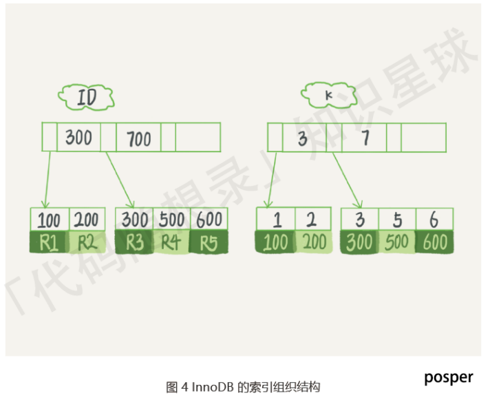

# 数据库-MySQL

>内容参考总结⾃⽹络资料，如⼩林coding、MySQL45讲

## 基础知识讲解

### MySQL基础

#### 主键、索引、外键

##### 什么是主键

主键是⼀列，其值可以唯⼀标识表中的每⼀⾏数据，每个表只能有⼀个主键，⽽且主键的值不能重复，也不能包含NULL值，通常⽤来保证数据的唯⼀性和⽤于在表中查找特定的⾏。

##### 主键、外键、索引的区别

**定义：**
主键：唯⼀标识⼀条记录，不允许重复，不允许为空
外键：外键是⼀个表中的字段，其值是另⼀个表的主键，⽤于建⽴两个表之间的关系。
索引：没有重复值，但可以有⼀个空值 ，⽤于快速查询到数据。

**作⽤：**
主键：⽤于唯⼀标识表中每⼀⾏的字段
外键：主要⽤于和其它表建⽴联系
索引：为了提⾼查询排序的速度

**区别：**
外键是⼀个表中的字段，它与另⼀个表的主键形成关联，⽤于建⽴表之间的关系。
主键和外键通常都与索引有关，但索引不⼀定是主键或外键。

#### MySQL表连接

##### 连接

将各个表中的记录都取出来进⾏依次匹配，将匹配后的结果发给客户端

##### 笛卡尔积

连接查询的结果中包含⼀个表的每⼀条记录与另⼀个表中每⼀条记录的组合，这样的查询结果就是笛卡尔积
⽐如表a有5条记录；表b有6条记录；a和b的笛卡尔积就是30

##### 连接过程

1、确定第⼀个需要查询的表，此表为`驱动表`
2、从驱动表中取每⼀条符合搜索条件的记录，到接下来的表中查找匹配的记录；驱动表之后的那个表就叫`被驱动表`

只需要访问驱动表⼀次，可能会多次访问被驱动表
每获得⼀条满⾜条件的驱动表记录，⻢上到被驱动表中寻找匹配的记录

##### 内连接

驱动表中的记录在被驱动表中找不到匹配的记录，那么驱动表的这条记录不会加⼊到最后的结果中

```sql
select * from 驱动表, 被驱动表;
select * from 驱动表 join 被驱动表;
select * from 驱动表 inner join 被驱动表;
select * from 驱动表 cross join 被驱动表;
```

##### 外连接

驱动表中的记录在被驱动表中找不到匹配的记录，也仍需要加⼊到最后结果中
左外连接：语句左侧的表为驱动表

```sql
select * from 驱动表 left join 被驱动表 on 连接条件;
```

右外连接：语句右侧的表为驱动表

```sql
select * from 被驱动表 right join 驱动表 on 连接条件;
```

对于内连接，驱动表和被驱动表的顺序可以更换；对于外连接，这个顺序不能随意更换

#### 过滤条件

##### where=

不论内外连接，只要是不符合 where ⼦句的记录都不会加⼊到最后的结果中

##### on

在内连接中与 where 等价；
在外连接中，如果驱动表中的记录在被驱动表中没有记录可以匹配，该驱动表记录仍会加⼊到结果中，对应的被驱动表字段以 null 填充

##### 嵌套循环连接

如果有3个表进⾏连接，那么表1和表2完成连接后的结果作为驱动表，将表3作为被驱动表进⾏连接查询

#### 执⾏⼀次 select 语句，发⽣了什么


MySQL 的架构共分为两层：Server 层和存储引擎层

- Server 层负责建⽴连接、分析和执⾏ SQL
- 存储引擎层负责数据的存储和提取, ⽀持 InnoDB、MyISAM、Memory 等多个存储引擎, 现在最常⽤的存储引擎是 InnoDB，其⽀持索引类型是 B+ 树索引。

##### 连接器：管理连接和权限验证

连接器跟客户端建⽴连接、获取权限、然后后⾯的权限逻辑判断都基于此时读取到的权限。

Mysql 会定期⾃动清理"空闲"连接，由参数 wait_timeout 控制的，默认值是 8 ⼩时。
由于建⽴连接⽐较复杂，所以尽量使⽤⻓连接，⽽不是 短连接(少量查询后，就断开连接)
但是，当`⻓连接`过多时，可能导致内存占⽤太⼤，被系统强⾏杀掉（OOM），会导致`MySQL`异常重启。

解决⽅案为:

- 定期断开⻓连接
- MySQL 5.7以后版本，可以通过执⾏ mysql_reset_connection 来重新初始化连接资源

##### 查询缓存

执⾏查询语句前，先看下查询缓存中是否有结果

- 如果有，则不必执⾏查询语句，直接取出缓存结果
- 如果没命中缓存，则执⾏查询语句，并将执⾏查询语句后的结果，放⼊查询缓存中

不建议使⽤查询缓存(当数据表频繁更新时，最新查询结果可能和查询缓存中存放的结果不⼀致)

>MySQL 8.0 开始，执⾏⼀条 SQL 查询语句，不会再⾛到查询缓存这个阶段了。

##### 解析SQL

你输⼊的是由多个字符串和空格组成的⼀条SQL语句，MySQL需要识别出⾥⾯的字符串分别是什么，代表什么。

- 词法分析：根据你输⼊的字符串识别出关键字出来
- 语法分析：根据词法分析的结果判断是否符合SQL语法，并构建SQL语法课

##### 执⾏SQL

分为三个阶段：预处理阶段、优化阶段、执⾏阶段

预处理阶段：判断表和字段是否存在

优化阶段：**将SQL查询语句的执⾏⽅案确定下来**，⽐如在表⾥⾯有多个索引的时候，优化器会基于查询成本的考虑，来决定选择使⽤哪个索引, 或者在⼀个语句有多表关联（join）的时候，决定各个表的连接顺序。

执⾏阶段：MySQL通过分析器知道了你要做什么，通过优化器知道了该怎么做，于是就进⼊了执⾏器阶段，开始执⾏语句（执⾏语句时，⾸先会判断当前⽤户是否有执⾏权限）。

#### 执⾏⼀次update语句，发⽣了什么

查询语句的流程，更新语句同样需要⾛⼀遍

1. 执⾏语句前先连接数据库
2. 数据库表有更新，跟表有关的查询缓存会失效，所以会清空之前的缓存结果
3. 分析器进⾏词法和语法解析，优化器进⾏优化，执⾏器负责执⾏，然后更新。

但是更新流程涉及到了两个重要的⽇志模块：`redo log(重做⽇志)`和`binlog(归档⽇志)`, 具体会在⽇志章节中讲解。

`redo log` 和 `binlog` 有什么不同？

- `redo log` 是 `InnoDB` 引擎特有的； `binlog`是`MySQL`的`Server`层实现的，所有引擎都可以使⽤。
`redo log`是物理⽇志，记录的是“在某个数据⻚上做了什么修改”；`binlog`是逻辑日志，记录的是这个语句的原始逻辑，⽐如“给`ID=2`这⼀⾏的`c`字段加`1`
`redo log`是循环写的，空间固定会⽤完；`binlog`是可以追加写⼊的。“追加写”是指`binlog`⽂件写到⼀定⼤⼩后会切换到下⼀个，并不会覆盖以前的⽇志。

### MySQL语句

⽬的：为了保证MySql服务器的安全，每个MySql的⽤户应该对他们需要的数据具有适当的访问权;
例如:

1. 多数⽤户只能够⽤到读写权限，只有少数⽤户能够创建表格和删除表格
2. ⼀些⽤户只能访问某个数据库⽽不能访问其他的数据库
3. ⼀些⽤户可以管理其他⽤户的账号，但⼤多数⼈不需要管理别⼈的账号

每个⽤户需要⽤到什么权限，就只给他们什么权限

如果每个⽤户的权限都很⾼，那数据库会变得⼗分危险，随时都需要⾯临很多误操作，所以要进⾏访问权限控制

#### ⽤户账号存储

在 MySql 下，所有的⽤户的账号，密码，对数据库的操作权限，都存储在 mysql 下（数据库的名字就叫 mysql）的 user 表格中。
user 表格有⼀个 user 属性，user 属性就是当前所有的⽤户名，通过以下操作可以查看当前 mysql 的⽤户⼀共有多少。

```sql
use mysql 
select user from user
```


#### ⽤户账号管理

既然 mysql 中的 user 表格中存放着当前 mysql 的⽤户，那么新增⽤户只需要在 user 表中使⽤ insert 语句新增⼀条记录即可。
不过为了安全起⻅不建议这样做，mysql 数据库存放着很重要的数据，这样直接对 mysql 数据库直接操作可能会伤害到 mysql 服务器。

##### 新增⽤户

新增⼀个⽤户的语法：

```sql
CREATE USER [user_name] IDENTIFIED BY [user_pwd]
```

例如：新增⽤户 zhangsan，pwd=123456

```sql
CREATE USER zhangsan IDENTIFIED BY '123456'
```

##### 修改⽤户名

修改⽤户名的语法：

```sql
RENAME USER [user_name] TO [new_user_name]
```

例如：例如将账号名从 zhangsan 改为 lisi

```sql
RENAME USER zhangsan TO lisi
```

##### 修改⽤户密码

修改⽤户密码语法

```sql
SET PASSWORD FOR [user_name] = Password('[new_pwd]')
```

这⾥使⽤ password 函数对新密码进⾏加密。
如果不指定⽤户名：

```sql
SET PASSWORD = Password('[new_pwd]')
```

默认为修改当前登陆的⽤户的密码。
例如：修改 lisi 账号的密码：

```sql
SET PASSWORD FOR lisi = Password('135790')
```

##### ⽤户账号删除

删除⽤户账号语法：

```sql
DROP USER [user_name]
```

例如：删除 lisi 的账号

```sql
DROP USER lisi
```

如果mysql版本低于mysql5，需要先revoke⽤户所有的权限，才能删除账号。更⾼版本则可以⼀次性删除权限和账号。

##### ⽤户权限控制

###### 查看⽤户权限

刚创建的的⽤户是没有任何权限的，使⽤以下语法查看某⽤户所拥有的权限：

```sql
SHOW GRANTS FOR [user_name]
```


⽽`GRANT USAGE ON *.* TO 'lS'@'%'`则代表了⽤户`ls`没有任何权限。

###### ⽤户授权

给⽤户授权的语法：

```sql
GRANT [权限名] ON [数据库名].[表名] TO [⽤户名]
```

例如：⽤户 'ls' 查找权限 select


从表格中可以看到`ls`新增的权限。

###### 撤销授权

撤销⽤户权限的语法：

```sql
REVOKE [权限名] ON [数据库名].[表名] FROM [⽤户名]
```

收回⽤户`ls`查找权限`select`


从表格中可以看初 ls 新增的权限消失了

### 索引

#### 什么是索引

索引：索引的出现其实就是为了提⾼数据查询的效率，就像书的⽬录⼀样
MySQL 在查询⽅⾯主要就是**两种⽅式**：

1. 全表扫描（⼀个⼀个挨个找）
2. 根据索引检索

#### 索引操作

##### 创建索引

```sql
create index 索引名 on 表名(列名);
# 也可以有多个列名构成索引（即，组合索引）
```

##### 删除索引

```sql
drop index 索引名 on 表名;
```

#### 怎么查看⼀个SQL语句是否使⽤了索引进⾏检索

在 SQL 语句前，添加 explian 关键字

- 当`type=ALL`时，表示使⽤ 全表查询（未使⽤索引）
- 当`type=RES`时，表示使⽤索引

#### 索引有哪些类别

- 按「数据结构」分类：B+tree索引、Hash索引、Full-text索引。
- 按「物理存储」分类：聚簇索引（主键索引）、⼆级索引（辅助索引）。
- 按「字段特性」分类：主键索引、唯⼀索引、普通索引、前缀索引。
- 按「字段个数」分类：单列索引、联合索引。

##### 按照数据结构分类

- 哈希表：使⽤ `key-value` 对存储数据 ，可能存在 hash 冲突（多个 value 对应同⼀个 key）
  - 优点：key ⽆序，插⼊数据时⽆需维护顺序（直接在最后⼀个元素后追加，即可），效率较⾼；
  - 缺点：因为不是有序的，所以哈希索引做区间查询的速度是很慢 
  - 适⽤场景：适⽤于只有等值查询的场景，⽽不适⽤频繁 区间查找
- 有序数组：
  - 优点：等值查询 和 区间查询 性能都挺6 （有序数组 适合 查询） 
  - 缺点：有序数组不适合 频繁 增/删 记录的场景 （但是，有序数组不适合 增/删）
  - 等值查询使⽤⼆分（前提是，有序 + 顺序存储），查询时间复杂度 O(log N)
  - 区间查询先⽤ ⼆分查找 “左边界”（不存在的时，则找第⼀个⽐ 它⼤的记录） ，然后，再向右扫描，直⾄⼤于右边界
  - 适⽤场景：有序数组只适⽤于静态存储引擎，在 等值查询 和 范围（区间）查询 场景中的性能⾮常优秀
- ⼆叉搜索树
  - BST 是为了 保留了 “有序数组” 查询（⼆分，O(logN)）性能好的优点，同时解决“有序数组” 不适合 增/删的缺点
  - BST 查询的时间复杂度：O(log N) ，但是，为了维持 O(log(N)) 的查询复杂度，就需要保持这棵树是平衡⼆叉树。（维护 BST 是 AVL 的时间复杂度也是 O(log(N))）
  - ⼆叉树是搜索效率最⾼的，但是实际上⼤多数的数据库存储却并不使⽤⼆叉树。其原因是，索引不⽌存在内存中，还要写到磁盘上
- N叉树
  - 
  - 为了让⼀个查询尽量少地读磁盘，就必须让查询过程访问尽量少的数据块。那么，我们就不应该使⽤⼆叉树，⽽是要使⽤ “N 叉”树（N 取决于数据块的⼤⼩）。即，通过使⽤ N 叉树 来降低 树的⾼度，即 减少读取磁盘的次数（IO是很慢的），提⾼查询效率 ⭐
  - N 叉树特点：
    - 折中 考虑了 “查询性能” 和 “读取磁盘的次数”，⼴泛应⽤于 数据库引擎中
    - MySQL 中，索引是在存储引擎层实现的，⽽且不同存储引擎的索引的⼯作⽅式并不⼀样。⽽即使多个存储引擎⽀持同⼀种类型的索引，其底层的实现也可能不同。

下⾯以InnoDB 为例，和你分析⼀下其中的索引模型

###### InnoDB 的索引模型

InnoDB 使⽤了 B+ 树索引模型，每⼀个索引在 InnoDB ⾥⾯对应⼀棵 B+ 树

假设建表语句如下，则对应的 2 棵 索引树（主键 ⾃动创建⼀颗；字段 k 创建 ⼀颗索引树），如下所示

```sql
create table T
(
    id int primary key, # 主键 ⾃动创建索引
    k int not null,
    name varchar(16),
    index (k)
) # 给字段 k 条件 索引
 
engine=InnoDB;
```



##### 按照存储分类

根据叶⼦节点的内容，索引类型分为主键索引（聚簇索引）和⼆级索引（辅助索引）：

- 主键索引的 B+Tree 的叶⼦节点存放的是实际数据，所有完整的⽤户记录都存放在主键索引的 B+Tree 的叶⼦节点⾥；
- ⼆级索引的 B+Tree 的叶⼦节点存放的是主键值，⽽不是实际数据。

###### 主键查询和⼆级索引查询

主键查询：直接在 主键索引 所在的 B+ 树中查询，然后直接返回查询到的叶⼦节点（此时，叶⼦节点⾥⾯就是整⾏记录）

⼆级索引查询：⾸先，在普通索引所在的 B+ 树中，查询到待查询记录的 主键； 然后，再根据这些查到的 主键，执⾏ “主键查询” （即，回表）

基于⾮主键索引的查询需要多扫描⼀棵索引树。因此，我们在应⽤中应该尽量使⽤主键查询。

不过当查询的数据是能在⼆级索引的 B+Tree 的叶⼦节点⾥查询到，这时就不⽤再查主键索引查，这种在⼆级索引的 B+Tree 就能查询到结果的过程就叫作「覆盖索引」

由于覆盖索引可以减少树的搜索次数，显著提升查询性能，所以使⽤覆盖索引是⼀个常⽤的性能优化⼿段。

##### 按照字段特性分类

- 主键索引：建⽴在主键字段上的索引，⼀张表最多只能有⼀个主键索引，不允许有空值。
- 唯⼀索引：建⽴在 UNIQUE 字段上的索引，⼀张表可以有多个唯⼀索引，索引列的值必须唯⼀，但是允许有空值。
- 普通索引：建⽴在普通字段上的索引
- 前缀索引：对字符类型字段的前⼏个字符建⽴的索引，⽽不是在整个字段上建⽴的索引，可以减⼩索引的⼤⼩，适⽤于较⻓列值的情况。

##### 按照字段个数分类

- 单列索引：建⽴在单列上的索引称为单列索引，⽐如主键索引；
- 联合索引：由多个列组合⽽成的索引。适⽤于多列的查询条件

#### 什么是最左匹配原则

通过将多个字段组合成⼀个索引，该索引就被称为联合索引。
使⽤联合索引时，存在**最左匹配原则**，也就是按照最左优先的⽅式进⾏索引的匹配。
最左匹配原则要求查询条件中的列应该从索引的最左边的列开始，并且不能跳过中间的列。如果查询条件不按照索引的顺序进⾏匹配，那么索引可能会失效。

举个例⼦：

- 如果查询条件为`WHERE column1 = 'value1'`，那么索引可以被有效使⽤。
- 如果查询条件为`WHERE column1 = 'value1' AND column2 = 'value2'`，同样索引可以被有效使⽤。
- 但如果查询条件为`WHERE column2 = 'value2'`或`WHERE column2 = 'value2' AND column3 = 'value3'`，则最左匹配原则不成⽴。

最左匹配时在遇到范围查询（如 >、<）的时候，就会停⽌匹配，范围查询的字段可以⽤到联合索引，但是范围查询字段的后⾯的字段⽆法⽤到联合索引。

#### 索引下推


那些不符合最左前缀的部分，会怎么样呢？
⽐如，执⾏如下语句时候，则存在不符合最左前缀的部分：

```sql
select * from tuser
where name like '张 %'
and age=10
and ismale=1;
```

根据前缀索引规则，这个语句在搜索索引树的时候，只能⽤ “张”，找到第⼀个满⾜条件的记录 ID3
然后在 MySQL 5.6 之前，只能从 ID3 开始⼀个个回表，到主键索引上找出数据⾏，再对⽐字段值。
⽽ MySQL 5.6 引⼊了索引下推优化(index condition pushdown)
**可以在联合索引遍历过程中，对联合索引中包含的字段先做判断，直接过滤掉不满⾜条件的记录，减少回表次数。**


由图3可知，本例中`⽆索引优化`时，需要回表`4`次；
图4中，采⽤索引下推优化，直接在索引遍历的过程中，过滤了不符合条件的记录（ID3、ID6），只⽤回表`2`次

#### 索引区分度

索引区分度表示某个字段不同值的个数占整个表的⽐例，建⽴联合索引时，要把区分度⼤的字段排在前⾯。

#### 建⽴索引的注意事项

- 索引不是越多越好，虽然索引会提⾼ select 效率，但是也降低了insert以及update的效率
- 数据量⼩的表不需要建⽴索引，会增加额外的索引开销 
- 不经常使⽤的列不要建⽴索引 
- 频繁更新的列不要建⽴索引，会影响更新的效率

#### 索引的优缺点

优点：

- 使⽤索引可以⼤⼤加快数据的检索速度（⼤⼤减少检索的数据量），这也是创建索引的最主要的原因。
- 但是注意使⽤索引不⼀定能够提⾼查询性能，因为如果数据库的数据量不⼤，那么使⽤索引也不⼀定能够带来很⼤提升。其余⼤多数情况下，索引查询⽐全表扫描要快。
- 通过创建唯⼀性索引，可以保证数据库表中每⼀⾏数据的唯⼀性。

缺点：

- 空间消耗，⼀个索引对应的就是⼀棵 B+树，每⼀个节点都是⼀个 16KB ⼤⼩的⻚。占⽤的空间较⼤。
- 创建索引和维护索引需要耗费许多时间，当对表中的数据进⾏增删改的时候，如果数据有索引，那么索引也需要动态的修改，会降低 SQL 执⾏效率。

#### 什么时候需要创建索引

- 频繁⽤于查询的列需要创建索引
- ⼤表：对于很⼤的表，建⽴索引可以提⾼查询速度
- 唯⼀性要求：主键列和唯⼀性约束的列会⾃动创建唯⼀索引，但如果查询中经常包含唯⼀性条件，可以额外创建唯⼀性索引。
- 连接表的外键列：为外键列创建索引可以提⾼连接的效率。
- 频繁使⽤排序和分组的列：如果某列经常⽤于 ORDER BY 或 GROUP BY ⼦句可以创建索引

#### 什么时候不需要创建索引

- ⼩表：在⼩表上，索引不会带来显著的性能提升，还会增加维护开销。
- 经常进⾏更新的字段不需要创建索引
- 很少⽤于查询的字段
- 字段中存在⼤量重复数据，不需要创建索引，⽐如性别字段

#### 索引优化的⽅法

- 前缀索引优化：使⽤某个字段中字符串的前⼏个字符建⽴索引，从⽽减⼩索引字段⼤⼩
- 覆盖索引优化：从⼆级索引中可以查询得到记录，避免回表
- 主键索引最好是⾃增的；这样每次插⼊⼀条新记录，都是追加操作，不需要重新移动数据，⽽使⽤⾮⾃增主键会导致插⼊主键的索引值是随机的，这可能会插⼊到现有数据⻚的某个位置，导致其他数据的移动，造成⻚分裂。
- 避免过多的索引

#### 索引什么时候会失效

使⽤左或者左右模糊匹配：⽐如 LIKE '%abc' 这样的查询会导致索引失效。
在索引列上使⽤函数或表达式： 索引列上参与计算，索引失效

```sql
SELECT * FROM table WHERE UPPER(column) = 'VALUE';
```

- 在 WHERE ⼦句中，如果在 OR 前的条件列是索引列，⽽在 OR 后的条件列不是索引列，那么索引会失效。
- 违背最左匹配原则，索引失效
- 数据分布不均匀： 如果数据分布不均匀，例如某个索引列的⼤多数值都相同，选择性降低，导致索引失效。
- 隐式类型转换： 如果查询中的条件涉及到隐式类型转换，例如将字符串与数字⽐较，索引可能⽆法被使⽤。

#### 为什么使⽤B+树索引

- B+树的⾮叶⼦节点不存放实际的记录数据，仅存放索引，所以**数据量相同的情况下，相⽐存储即存索引⼜存记录的 B 树，B+树的⾮叶⼦节点可以存放更多的索引，因此 B+ 树可以⽐ B 树更「矮胖」，查询底层节点的磁盘 I/O次数会更少。**
- B+ 树有⼤量的冗余节点（所有⾮叶⼦节点都是冗余索引），这些冗余索引让 B+ 树在插⼊、删除的效率都更⾼，⽐如删除根节点的时候，不会像 B 树那样会发⽣复杂的树的变化；
- B+ 树叶⼦节点之间⽤链表连接了起来，有利于范围查询，⽽ B 树要实现范围查询，因此只能通过树的遍历来完成范围查询，这会涉及多个节点的磁盘 I/O 操作，范围查询效率不如 B+ 树。

### 事务

思维导图：


MySQL原⽣引擎MyISAM不⽀持事务，所以被InnoDB取代。

#### 事务的四⼤特性 ACID

ACID（Atomicity、Consistency、Isolation、Durability，即原⼦性、⼀致性、隔离性、持久性）

##### 原⼦性

事务是⼀个不可分割的⼯作单元，要么完全执⾏，要么完全不执⾏。如果在事务执⾏的过程中发⽣了错误，系统会撤销事务中已经执⾏的操作，将数据库恢复到事务开始前的状态。原⼦性是通过 undo log（回滚⽇志） 来保证的。

##### ⼀致性

确保事务将数据库从⼀个⼀致的状态转变为另⼀个⼀致的状态。事务执⾏的结果必须满⾜数据库的完整性约束和规则，保持数据库的⼀致性。⼀致性则是通过持久性+原⼦性+隔离性来保证的。

##### 隔离性

多个事务并发执⾏时，每个事务都不能看到其他事务的中间状态。每个事务都应该感觉就像它是唯⼀在数据库上运⾏的事务⼀样。防⽌了多个事务之间的相互⼲扰。隔离性是通过 MVCC（多版本并发控制） 或锁机制来保证的。

##### 持久性

⼀旦事务被提交，其结果将永久保存在数据库中，即使系统发⽣故障。即使系统发⽣崩溃，事务的结果也不应该丢失，持久性是通过`redo log(重做⽇志)`来保证的。

#### 并⾏事务会出现什么问题

并⾏事务是指多个事务同时执⾏，这可以提⾼数据库系统的性能和吞吐量。但是并⾏事务也可能引发⼀些问题

1. 脏读：读到其他事务未提交的数据
⼀个事务读取了另⼀个事务未提交的数据，如果另⼀个事务后来回滚，读取的数据就是⽆效的。读到了并⼀定最终存在的数据，这就是脏读。

2. 不可重复读：前后读取的数据不⼀致
在⼀个事务内，同⼀查询可能返回不同的结果，因为在事务执⾏期间其他事务可能修改了数据。

3. 幻读：前后读取的记录数量不⼀致
在⼀个事务内多次查询某个符合查询条件的「记录数量」，如果出现前后两次查询到的记录数量不⼀样的情况，就意味着发⽣了「幻读」现象。

这三个现象严重性排序如下：


#### 隔离级别

隔离级别是指多个并发事务之间相互隔离的程度，SQL标准定义了4个隔离级别


1. 读未提交：
最低的隔离级别。在这个级别下，⼀个事务可以读取到另⼀个事务未提交的数据。这可能导致脏读（DirtyReads）和不可重复读、幻读等问题。

2. 读提交：
在这个级别下，⼀个事务只能读取到已经提交的其他事务的数据。这解决了脏读的问题，但仍可能遇到不可重复读的问题。

3. 可重复读
在这个级别下，⼀个事务在其⽣命周期内多次执⾏相同的查询，将始终看到相同的数据，但是，仍可能发⽣幻读。也是MySQL InnoDB 引擎的默认隔离级别；

4. 可串⾏化
提供了最⾼的隔离级别。会对记录加上读写锁，在多个事务对这条记录进⾏读写操作时，如果发⽣了读写冲突的时候，后访问的事务必须等前⼀个事务执⾏完成，才能继续执⾏，在这个级别下，事务的执⾏效果就好像它们是按顺序执⾏的，事务之间没有并发。这可以防⽌脏读、不可重复读和幻读，但也可能导致性能下降，因为并发性降低。

选择隔离级别需要根据应⽤程序的要求和性能需求进⾏权衡。较低的隔离级别提供更⾼的并发性能，但可能牺牲⼀致性。较⾼的隔离级别提供更强的⼀致性，但可能降低并发性能。


- 在「读未提交」隔离级别下，可能发⽣脏读、不可重复读和幻读现象；
- 在「读提交」隔离级别下，可能发⽣不可重复读和幻读现象，但是不可能发⽣脏读现象；
- 在「可重复读」隔离级别下，可能发⽣幻读现象，但是不可能脏读和不可重复读现象；
- 在「串⾏化」隔离级别下，脏读、不可重复读和幻读现象都不可能会发⽣。

#### 幻读是如何解决的

MySQL InnoDB 引擎的默认隔离级别虽然是「可重复读」，但是它很⼤程度上可以避免幻读现象。解决的⽅案有两种：

- 针对快照读（普通 select 语句），是通过 MVCC ⽅式解决了幻读
- 针对当前读：（select ... for update 等语句），是通过 next-key lock（记录锁+间隙锁）⽅式解决了幻读，因为当执⾏ select ... for update 语句的时候，会加上 next-key lock，如果有其他事务在 next-key lock 锁范围内插⼊。

#### 事务隔离的实现

隔离级别具体是如何实现的呢？

- 对于读未提交，可以读到未提交事务修改的数据，所以直接读取最新的数据就可以。
- 对于串⾏化：加读写锁的⽅式来避免并⾏访问
- 对于读提交和可重复读，通过 Read View 来实现的
  - 「读提交」隔离级别是在每个 select 都会⽣成⼀个新的 Read View，也意味着，事务期间的多次读取同⼀条数据，前后两次读的数据可能会出现不⼀致，因为可能这期间另外⼀个事务修改了该记录，并提交了事务。
  - 「可重复读」隔离级别是启动事务时⽣成⼀个 Read View，然后整个事务期间都在⽤这个 Read View，这样就保证了在事务期间读到的数据都是事务启动前的记录。

#### Read View在MVCC中是如何⼯作的

1. 事务启动：当⼀个事务启动时，系统会为该事务创建⼀个 Read View。
2. Read View 包含的信息
    
   - m_ids : 当前数据库中「活跃事务」的事务 id 列表, 表示启动了但还没有提交的事务
   - min_trx_id : 「活跃事务」中事务id 最⼩的事务
   - max_trx_id : 当前数据库中应该给下⼀个事务的 id 值
   - creator_trx_id : 创建该Read View的事务的id

    除此之外，聚簇索引记录中都包含下⾯两个隐藏列：

    - trx_id ，当⼀个事务对某条聚簇索引记录进⾏改动时，就会把该事务的事务 id 记录在 trx_id 隐藏列⾥；
    - roll_pointer ，每次对某条聚簇索引记录进⾏改动时，都会把旧版本的记录写⼊到 undo ⽇志中，然后这个隐藏列是个指针，指向每⼀个旧版本记录，于是就可以通过它找到修改前的记录。

3. 事务读取数据：当⼀个事务要执⾏读操作时，系统会使⽤ Read View 来确定该事务能够看到哪些数据版本。具体步骤如下：
   - 如果记录的 trx_id ⼩于Read View 中的 min_trx_id 值，表示这个版本的记录是在创建 Read View 前已经提交的事务⽣成的，所以该版本的记录对当前事务可⻅。
   - 如果记录的 trx_id 值⼤于等于 Read View 中的 max_trx_id 值，表示这个版本的记录是在创建 Read View 后才启动的事务⽣成的，所以该版本的记录对当前事务不可⻅。
   - 如果记录的 trx_id 值在 Read View 的 min_trx_id 和 max_trx_id 之间，需要判断 trx_id 是否在m_ids 列表中：
     - 如果记录的 trx_id 在 m_ids 列表中，表示⽣成该版本记录的活跃事务依然活跃着（还没提交事务），所以该版本的记录对当前事务不可⻅。
     - 如果记录的 trx_id 不在 m_ids 列表中，表示⽣成该版本记录的活跃事务已经被提交，所以该版本的记录对当前事务可⻅。

4. 事务提交：当⼀个事务提交时，它的事务ID会加⼊到已提交的事务ID集合中。这样，其他事务的 Read View就能够看到该事务提交的数据版本。

#### 读已提交是怎么实现的

使⽤ MVCC(多版本并法控制) 实现的

- 读操作：在MVCC中，每个事务在读取数据时都可以看到数据的⼀个版本。已提交的事务产⽣⼀个版本，⽽未提交的事务则不会对其他事务可⻅。因此，读已提交只能看到已提交事务的版本。
- 写操作： 写操作创建⼀个新的数据版本，⽽不是直接修改原始数据。这确保了正在进⾏的事务不会看到未提交事务的更改。

#### 事务的启动⽅式

显式启动事务语句

```sql
begin/start transaction、commit、rollback
```

关闭线程的⾃提交

```sql
set autocommit=0;
```

事务会持续存在直到你主动执⾏commit或者rollback，或者断开连接，所以，如果采取了第⼆种⽅法，就导致了接下来的查询都在事务中，如果是⻓连接，就导致了⻓事务。

所以，建议使⽤ set autocommit=1

##### ⻓事务的查询

在informationschema库下的innodbtrx表中查询。

##### 举个栗⼦

如何避免⻓事务对业务的影响？

##### 从应⽤开发端来看

1. 确定是否使⽤了set autocommit=0，如是，则改成1
2. 确定是否有不必要的只读事务
3. 业务连接数据库的时候，控制每个语句执⾏的最⻓时间 set maxexecutiontime

##### 从数据库端来看

1. 监控相关表，设置⻓事务阈值，超过就报警/kill
2. 可使⽤percona的pt-kill⼯具
3. 在功能测试阶段输出所有的log，分析⽇志提前发现问题
4. 把innodbundotablespaces设置成2或者更⼤的值

### 锁

多个事物在【并发情况下】会出现⼀些经典的问题，如脏读、不可重复读、幻读、丢失更新。为了不同程度的解决这些问题，出现了不同的隔离级别，锁就是实现各种隔离级别的⼀种⽅式。


#### 锁的种类

##### 全局锁

顾名思义，全局锁就是**对整个数据库**实例加锁。
**典型使⽤场景**：全库逻辑备份，即把整个库的表都select出来存成⽂本
MySQL 提供了⼀个加全局读锁的⽅法，命令是

```sql
flush tables with read lock (FTWRL)
```

当你需要让整个库处于只读状态的时候，可以使⽤这个命令，之后其他线程的以下语句会被阻塞：

- 数据更新语句（数据的增删改）
- 数据定义语句（包括建表、修改表结构等）
- 更新类事务的提交语句

##### 表级锁

MySQL ⾥⾯表级别的锁有下⾯⼏种：

###### 表锁

特点：

- 每次操作锁住整张表
- 开销⼩，加锁快
- 并发度最低

表锁的语法是`lock tables … read/write`
与 FTWRL 类似，可以⽤`unlock tables`主动释放锁，也可以在客户端断开的时候⾃动释放。
**需要注意**：`lock tables`语法除了会限制别的线程的读写外，也限定了本线程接下来的操作对象

###### 元数据锁（meta data lock，MDL）

MDL 不需要显式使⽤，在访问⼀个表的时候会被⾃动加上。
MDL 的作⽤：保证读写的正确性。

你可以想象⼀下，如果⼀个查询正在遍历⼀个表中的数据，⽽执⾏期间另⼀个线程对这个表结构做变更，删了⼀列，那么查询线程拿到的结果跟表结构对不上，肯定是不⾏的。
在 MySQL 5.5 版本中引⼊了 MDL

当对⼀个表做增删改查操作的时候，加 MDL 读锁；
当要对表做结构变更操作的时候，加 MDL 写锁。

读锁之间不互斥，因此你可以有多个线程同时对⼀张表增删改查。读写锁之间、写锁之间是互斥的，⽤来保证变更表结构操作的安全性。因此，如果有两个线程要同时给⼀个表加字段，其中⼀个要等另⼀个执⾏完才能开始执⾏。

事务中的 MDL 锁，在语句执⾏开始时申请，但是语句结束后并不会⻢上释放，⽽会等到整个事务提交后再释放。（这可能会产⽣死锁的问题）

###### 意向锁

意向锁⽤于指示⼀个事务在未来可能会请求对某些资源（如数据⾏）的锁定

- 意向共享锁表示事务打算在资源上获得共享锁。其他事务可以继续获得共享锁，但不能获得排他锁。
- 意向排他（独占）锁： 表示事务打算在资源上获得排他锁。

对某些记录加上「共享锁」之前，需要先在表级别加上⼀个「意向共享锁」，对某些纪录加上「独占锁」之前，需要先在表级别加上⼀个「意向独占锁」。
意向共享锁和意向独占锁是表级锁，不会和⾏级的共享锁和独占锁发⽣冲突，意向锁之间也不会发⽣冲突，只会和共享表锁和独占表锁发⽣冲突。意向锁的⽬的是为了快速判断表⾥是否有记录被加锁。

###### AUTO-INC 锁

**作⽤**：表⾥的主键通常都会设置成⾃增的，之后可以在插⼊数据时，可以不指定主键的值，数据库会⾃动给主键赋值递增的值通过`AUTO-INC`锁实现的。**在插⼊数据时，会加⼀个表级别的 AUTO-INC 锁**，然后为被`AUTO_INCREMENT`修饰的字段赋值递增的值，等插⼊语句执⾏完成后，才会把 AUTO-INC 锁释放掉。其他事务的如果要向该表插⼊语句都会被阻塞，从⽽保证插⼊数据时字段的值是连续递增的。

**缺陷**：对⼤量数据进⾏插⼊的时候，会影响插⼊性能，因为其他事务中的插⼊会被阻塞。

**改进**：InnoDB 存储引擎提供了⼀种轻量级的锁来实现⾃增。在插⼊数据的时候，会为被 AUTO_INCREMENT 修饰的字段加上轻量级锁，然后给该字段赋值⼀个⾃增的值，就把这个轻量级锁释放了，⽽不需要等待整个插⼊语句执⾏完后才释放锁

##### ⾏级锁

顾名思义，⾏锁就是针对数据表中⾏记录的锁（也有⼈称为记录锁）。

这很好理解，⽐如事务 A 更新了⼀⾏，⽽这时候事务 B 也要更新同⼀⾏，则必须等事务 A 的操作完成后才能进⾏更新。

**类型**：

- Record Lock，记录锁，仅仅把⼀条记录锁上，记录锁分为排他锁和共享锁。
- Gap Lock，间隙锁，锁定⼀个范围，但是不包含记录本身，只存在于可重复读隔离级别，⽬的是为了解决可重复读隔离级别下幻读的现象。间隙锁之间是兼容的，两个事务可以同时持有包含共同间隙范围的间隙锁，并不存在互斥关系。
- Next-Key Lock：Record Lock + Gap Lock 的组合，锁定⼀个范围，并且锁定记录本身。next-key lock 即能保护该记录，⼜能阻⽌其他事务将新纪录插⼊到被保护记录前⾯的间隙中。

特点：

- 每次操作锁住⼀⾏数据
- 开销⼤，加锁慢
- 发⽣锁冲突的概率是最低的，并发度是最⾼的

在 InnoDB 事务中，⾏锁是在需要的时候才加上的，但并不是不需要了就⽴刻释放，⽽是要等到事务结束时才释放。这个就是两阶段锁协议。

知道了这个设定，对我们使⽤事务有什么帮助呢？那就是，如果你的事务中需要锁多个⾏，要把最可能造成锁冲突、最可能影响并发度的锁尽量往后放。

**加锁规则**
加锁规则⾥⾯，包含了两个“原则”、两个“优化”和⼀个“bug”

**两个原则**：

1. 加锁的基本单位是 next-key lock。希望你还记得，next-key lock 是前开后闭区间。
2. 查找过程中访问到的对象才会加锁。

**两个优化**：

1. 索引上的等值查询，给唯⼀索引加锁的时候，next-key lock 退化为⾏锁。 
2. 索引上的等值查询，向右遍历时且最后⼀个值不满⾜等值条件的时候，next-key lock 退化为间隙锁。

**⼀个"bug"**：

1. 唯⼀索引上的范围查询会访问到不满⾜条件的第⼀个值为⽌。（MySQL8.0之后的版本已经修复）

以上规则是在可重复读隔离级别 (repeatable-read) 下验证的。同时，可重复读隔离级别遵守两阶段锁协议，所有加锁的资源，都是在事务提交或者回滚的时候才释放的。如果切换到读提交隔离级别 (read-committed) 的话，就好理解了，过程中去掉间隙锁的部分，也就是只剩下⾏锁的部分。

#### 锁的划分

##### 数据库⻆度

###### 共享锁（共享锁也叫读锁或 S 锁）

共享锁锁定的资源可以被其他⽤户读取，但不能修改。
在进⾏SELECT的时候，会将对象进⾏共享锁锁定，当数据读取完毕之后，就会释放共享锁，这样就可以保证数据在读取时不被修改。
如果我们想要给某⼀⾏加上共享锁呢，⽐如想对 user_id=10的数据⾏加上共享锁，可以像下⾯这样:

```sql
SELECT user_id FROM product_comment WHERE user_id = 10 LOCK IN SHARE MODE;
```

###### 排他锁（排它锁也叫独占锁、写锁或 X 锁）

排它锁锁定的数据只允许进⾏锁定操作的事务使⽤，其他事务⽆法对已锁定的数据进⾏查询或修改。
如果我们想要在某个数据⾏上添加排它锁，⽐如针对 user_id=10的数据⾏，则写成如下这样：

```sql
SELECT user_id FROM product_comment WHERE user_id = 10 FOR UPDATE;
```

另外当我们对数据进⾏更新的时候，也就是INSERT、DELETE或者UPDATE的时候，数据库也会⾃动使⽤排它锁，防⽌其他事务对该数据⾏进⾏操作。

###### 共享锁与排他锁

共享锁和排他锁不仅可以锁住⼀⾏，也可以锁住⼀张表，如下所示：
⽐如我们想给 product_comment 在表上加共享锁，可以使⽤下⾯这⾏命令

```sql
LOCK TABLE product_comment READ;
```

如果我们想要对表上的共享锁进⾏解锁，可以使⽤下⾯这⾏命令：

```sql
UNLOCK TABLE;
```

如果我们想给 product_comment 数据表添加排它锁，可以使⽤下⾯这⾏命令

```sql
LOCK TABLE product_comment WRITE;
```

这时只有获得排它锁的事务可以对`product_comment`进⾏查询或修改，其他事务如果想要在`product_comment`表上查询数据，则需要等待。
你可以⾃⼰开两个 MySQL 客户端来模拟下。这时我们释放掉排它锁，使⽤这⾏命令即可

```sql
UNLOCK TABLE;
```

###### 意向锁（Intent Lock）

简单来说就是给更⼤⼀级别的空间示意⾥⾯是否已经上过锁。
**举例**：
你可以给整个房⼦设置⼀个标识，告诉它⾥⾯有⼈，即使你只是获取了房⼦中某⼀个房间的锁。这样其他⼈如果想要获取整个房⼦的控制权，只需要看这个房⼦的标识即可，不需要再对房⼦中的每个房间进⾏查找。这样是不是很⽅便？

返回数据表的场景，如果我们给某⼀⾏数据加上了排它锁，数据库会⾃动给更⼤⼀级的空间，⽐如数据⻚或数据表加上意向锁，告诉其他⼈这个数据⻚或数据表已经有⼈上过排它锁了，这样当其他⼈想要获取数据表排它锁的时候，只需要了解是否有⼈已经获取了这个数据表的意向排他锁即可。

如果事务想要获得数据表中某些记录的共享锁，就需要在数据表上添加意向共享锁。同理，事务想要获得数据表中某些记录的排他锁，就需要在数据表上添加意向排他锁。这时，意向锁会告诉其他事务已经有⼈锁定了表中的某些记录，不能对整个表进⾏全表扫描。

##### 程序员⻆度

###### 乐观锁（Optimistic Locking）

认为对同⼀数据的并发操作不会总发⽣，属于⼩概率事件，不⽤每次都对数据上锁，也就是不采⽤数据库⾃身的锁机制，⽽是通过程序来实现。在程序上，我们可以采⽤版本号机制或者时间戳机制实现。

###### 悲观锁（Pessimistic Locking）

也是⼀种思想，对数据被其他事务的修改持保守态度，会通过数据库⾃身的锁机制来实现，从⽽保证数据操作的排它性。

###### 乐观锁和悲观锁的适⽤场景

（1）乐观锁
适合读操作多的场景，相对来说写的操作⽐较少。它的优点在于程序实现，不存在死锁问题，不过适⽤场景也会相
对乐观，因为它阻⽌不了除了程序以外的数据库操作。

（2）悲观锁
适合写操作多的场景，因为写的操作具有排它性。采⽤悲观锁的⽅式，可以在数据库层⾯阻⽌其他事务对该数据的
操作权限，防⽌读 - 写和写 - 写的冲突。但是加锁的时间会⽐较⻓，可能会⻓时间限制其他⽤户的访问，也就是说
他的并发访问性不好。

#### Innodb使⽤表锁还是⾏锁

对于Innodb，绝⼤部分情况应该使⽤⾏锁
使⽤表锁的情况
（1）表⽐较⼤，事务需要更新全部或者⼤部分数据
（2）事务涉及到多个表，⽐较复杂，可能引起死锁，造成⼤量的事务回滚
